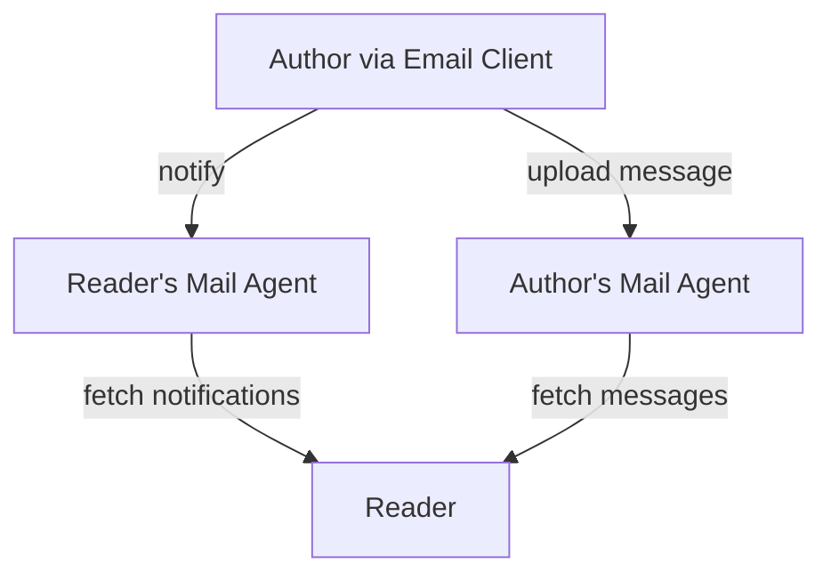
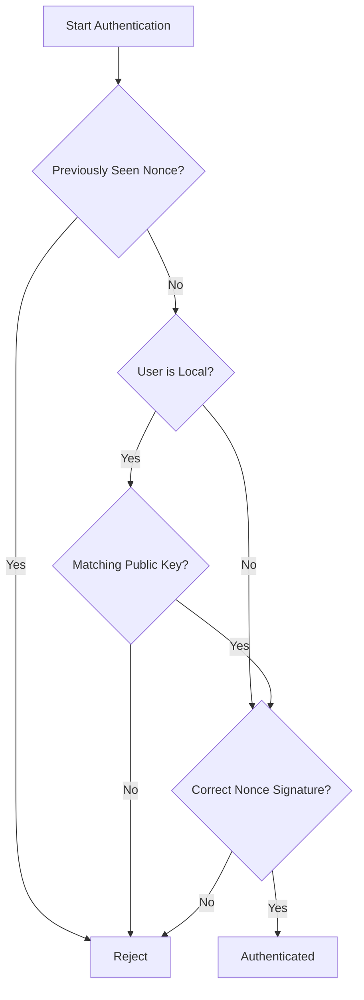

# Mail/HTTPS - The OpenEmail Protocol

- [Preface](#preface)
- [Introduction](#introduction)
  - [Complexity](#complexity)
  - [Deliverability](#deliverability)
  - [Address Secrecy](#address-secrecy)
- [The New Terminology](#the-new-terminology)
  - [Authors and Readers](#authors-and-readers)
  - [Mail Agents](#mail-agents)
  - [Email Address](#email-address)
  - [Public Profile](#public-profile)
  - [Links](#links)
  - [Broadcasts](#broadcasts)
  - [Encryption](#encryption)
  - [Signing](#signing)
  - [Keys Rotation](#keys-rotation)
  - [Authentication](#authentication)
  - [Notifications](#notifications)
  - [Message Lifetime](#message-lifetime)
  - [Storage Separation](#storage-separation)
  - [Multiplicity](#multiplicity)
  - [Flow Overview](#flow-overview)
- [Email Address](#email-address-1)
  - [Character Set](#character-set)
  - [Local Part](#local-part)
  - [Domain Part](#domain-part)
  - [Display Name](#display-name)
- [Links](#links-1)
- [Mail Agent](#mail-agent)
  - [Discovery](#discovery)
  - [Optimal Delegation](#optimal-delegation)
- [Public Profile](#public-profile-1)
  - [Profile Location](#profile-location)
  - [Required Fields](#required-fields)
  - [Optional Fields](#optional-fields)
  - [Unstructured Fields](#unstructured-fields)
- [Public Profile Image](#public-profile-image)
  - [Profile Image Location](#profile-image-location)
  - [Privacy Concerns](#privacy-concerns)
- [Encryption & Signing](#encryption-and-signing)
  - [Key IDs](#key-ids)
  - [Fingerprints](#fingerprints)
  - [Anonymous Asymmetric Encryption](#anonymous-asymmetric-encryption)
  - [Large Message Handling](#large-message-handling)
  - [Signing](#signing-1)
- [Message Object](#message-object)
  - [Lifetime](#lifetime)
  - [Access Rights](#access-rights)
  - [Message-Id](#message-id)
  - [Payload](#payload)
  - [Encoding](#encoding)
  - [Plaintext](#plaintext)
  - [Files (Attachments)](#files-attachments)
  - [Size](#size)
  - [Headers](#headers)
  - [Categorization](#categorization)
- [Message Envelope](#message-envelope)
  - [Required Headers](#required-headers)
  - [Conditional Headers](#conditional-headers)
  - [Content Headers](#content-headers)
    - [Mandatory Headers](#mandatory-headers)
    - [Conditional Headers](#conditional-headers-1)
- [Notifications](#notifications-1)
  - [Payload](#payload-1)
  - [Identifier](#identifier)
  - [Lifetime](#lifetime-1)
  - [Verification](#verification)
  - [Execution](#execution)
  - [Suppression](#suppression)
- [Special Use Cases](#special-use-cases)
  - [Key Rotations](#key-rotations)
  - [Replies](#replies)
  - [Forwarding](#forwarding)
  - [Threading](#threading)
  - [Broadcasting](#broadcasting)
    - [Direct Public Access](#direct-public-access)
    - [Public Indexing](#public-indexing)
    - [Re-broadcasting Messages](#re-broadcasting-messages)
    - [Public Replies](#public-replies)
  - [Streams](#streams)
  - [Address Expansions](#address-expansions)
    - [Envelope](#envelope)
    - [Content Headers](#content-headers-1)
- [HTTPS API](#https-api)
  - [Authentication](#authentication-1)
    - [SOTN Scheme](#sotn-scheme)
    - [SOTN Authorization Header Example](#sotn-authorization-header-example)
  - [Public API](#public-api)
    - [Discovery](#discovery-1)
      - [Domain](#domain)
      - [Address](#address)
    - [Provisioning](#provisioning)
      - [Create](#create)
      - [Delete](#delete)
    - [Profile](#profile)
    - [Profile Image](#profile-image)
    - [Links](#links-2)
      - [Query](#query)
    - [Notifications](#notifications-2)
      - [Abuse Prevention](#abuse-prevention)
    - [Messages](#messages)
      - [Private Messages](#private-messages)
        - [List](#list)
        - [Retrieve](#retrieve)
      - [Broadcast Messages](#broadcast-messages)
        - [List](#list-1)
        - [Retrieve](#retrieve-1)
  - [Private API](#private-api)
    - [Authenticated Discovery](#authenticated-discovery)
    - [Notifications](#notifications-3)
      - [List](#list-2)
    - [Messages](#messages-1)
      - [List](#list-3)
      - [Retrieve](#retrieve-2)
      - [Status](#status)
      - [Upload](#upload)
      - [Delete](#delete-1)
    - [Profile](#profile-1)
      - [Update](#update)
    - [Profile Image](#profile-image-1)
      - [Update](#update-1)
      - [Delete](#delete-2)
    - [Links](#links-3)
      - [List](#list-4)
      - [Store](#store)
      - [Delete](#delete-3)

# Preface

Legacy email was never intentionally designed; it evolved organically, inheriting outdated paradigms from the postal system-centralized control, privacy violations, censorship, and reliance on third parties.

It's time for a clean break. OpenEmail introduces Mail/HTTPS, a modern, decentralized, and secure protocol built on HTTPS (HTTP over TLS). Instead of treating email as a "sending" mechanism, Mail/HTTPS rethinks it as a sharing protocol, leveraging the web's natural strengths.

With Mail/HTTPS, self-hosting email is as simple as running a website. There are no blacklists, spam filtering, IP reputation concerns, or arbitrary limits-just a universal, secure, and open communication channel.

By building on HTTPS, we solve the fundamental flaws of SMTP-based email: security, authenticity, spam, privacy, size constraints, and message lifecycle management. OpenEmail paves the way for truly digital-native messaging-open, private, and built for the future.

# Introduction

Mail/HTTPS (Mail over HTTPS - MoH) is a modern, asynchronous, stateless messaging protocol that replaces traditional email by leveraging existing HTTPS infrastructure. It simplifies messaging, authentication, and open social networking while eliminating reliance on centralized third parties.

Beyond preventing spam and ensuring end-to-end privacy, Mail/HTTPS reduces complexity and operational overhead. From our experience running large-scale legacy email systems, Mail/HTTPS requires up to 80% fewer resources, cutting costs and significantly lowering environmental impact.

## Complexity

Email was once the original killer-app of the internet, but its traditional push-based SMTP model is increasingly out of step with modern needs. Despite numerous updates to tackle spam, phishing, authenticity, reputation, and security, these issues have only grown as email usage continues to rise.

Progress is slow because spam filtering often clashes with privacy demands, and spammers quickly adapt to new measures. As a result, email hosting has become more complex and expensive without a clear solution.

Yet, email remains essential-it supports account creation, commercial transactions, and serves as a universal online identity. Today's email infrastructure is dominated by three major providers, leading to increasing centralization and threatening the open, democratic principles on which the Internet was built.

## Deliverability

In legacy email, deliverability is often framed as a priority-essentially measuring how easily senders can inject messages into our inboxes. Ironically, this contradicts what recipients actually want: control over what reaches them. Yet, push-based email grants senders disproportionate power, forcing us to rely on filters, blacklists, bounces, and other reactive measures.

It's time to abandon these outdated constraints.

Mail/HTTPS reverses this dynamic entirely. As a pull-based system, it puts control back where it belongs: with the recipient. We decide whose messages to retrieve and when. The concept of 'deliverability' becomes obsolete-our inbox is truly ours, free from external interference.

## Address Secrecy

In legacy email, keeping addresses private is essential, especially for public figures, institutions, and high-profile individuals. Once exposed, an email address becomes a target for spam, phishing, ransomware, and other unwanted messages, creating both privacy concerns and security risks.

Mail/HTTPS eliminates this problem entirely. Knowing an address does not grant access to the inbox. Unlike legacy email, where an exposed address invites abuse, Mail/HTTPS ensures that users remain in full control of what they receive. This fundamental shift allows addresses to be shared publicly without compromising security or privacy.

# The New Terminology

Mail/HTTPS is designed to function like traditional email, so users don't need to learn an entirely new system or change how they communicate. While it preserves familiar functionality, it introduces key terminology changes to make email more intuitive and user-friendly.

## Authors and Readers

Legacy email uses terms like "senders" and "recipients," which imply a one-way action. Mail/HTTPS replaces these with "authors" and "readers."

- Authors compose messages and share them within their own environment, either publicly or with specific readers.
- Readers retrieve messages from authors when they choose to, based on their interest.

This shift in terminology reflects a more democratic and user-centric approach to email. Instead of senders forcing messages onto recipients, both sides retain full control over their communication and interactions.

## Mail Agents

In Mail/HTTPS, each domain designates one or more always-online mail agents, similar to Mail Exchange (MX) hosts in SMTP. However, unlike MX hosts, these agents do not accept inbound messages from others.

Instead, mail agents operate in a store-and-forward fashion, caching outbound messages for retrieval by the intended readers. This ensures that messages are available when requested, without exposing the system to unwanted or unsolicited traffic.

## Email Address

Mail/HTTPS retains the traditional addressing scheme of SMTP-based email, with minor normalization based on widely accepted conventions. This ensures a seamless transition between legacy email and Mail/HTTPS, preserving the familiar user experience without requiring significant changes.

In SMTP email, addresses are called "email addresses" because they are primarily used for messaging. However, their role has expanded far beyond communication-they now serve as universal digital identities, used for authentication, account recovery, and online verification.

In Mail/HTTPS, addresses represent more than just users; they can also identify online accounts, profiles, public information, broadcasts, and data. For simplicity, this document refers to what is traditionally called an "email address" simply as an "address."

## Public Profile

Email predates the web and social networking platforms that now shape our personal and professional interactions. In today's interconnected world, knowing someone's status, availability, or location provides valuable context for effective communication. Certain details, when made public, also enhance a person's online presence.

Legacy email offers no way to verify recipient availability before sending a message, leading to missed expectations and ineffective communication. Various efforts, such as WebFinger and BIMI, attempted to address this gap by adding user profiles, brand images, and metadata. However, these initiatives failed to achieve widespread adoption, leaving users reliant on bloated email footers and provider-specific profiles with no standard way to enrich email addresses with additional information.

Mail/HTTPS solves this by introducing public profiles. Each address is linked to a standardized URI, directly derived from the email address itself. These profiles are managed by the individual's mail agents, providing a decentralized yet standardized way to share identity and metadata.

Beyond usability, public profiles serve a critical role in distributing public cryptographic keys and establishing trust within the OpenEmail network.

## Links

Mail/HTTPS restricts messaging to parties who have mutually agreed to exchange messages. Messages are only shared between authorized and consenting users, significantly enhancing privacy and security.

To prevent unauthorized messages and protect correspondents' identities from exposure to third parties (such as service providers or infrastructure operators), Mail/HTTPS establishes a unique, mutual connection identifier for each email relationship. This identifier, called a "link," is derived from the two involved addresses and represents their trusted connection.

Mail/HTTPS links ensure that correspondents’ identities remain private throughout their communication, even from email service providers. At the same time, they allow providers to enforce allow-listing rules, ensuring security without compromising user privacy.

## Broadcasts

SMTP-based email was originally designed for one-to-one communication. Over time, it was adapted for multiple recipients, but without a secure or efficient way to handle broadcasting.

Yet, broadcasting is essential for businesses and individuals who need to reach larger audiences - with recipient consent. Since SMTP lacks built-in mass messaging capabilities, users rely on third-party "mail blasting" services, which introduce abuse, complexity, and inefficiency. These services exist primarily to circumvent the limitations of legacy email, but their very existence conflicts with the interests of end users.

Mail/HTTPS solves this by adopting a pull-based model, similar to RSS. Instead of pushing messages, authors post content, and readers choose to subscribe or unsubscribe using only the author's address. This eliminates the need for broadcasters to manage subscriber lists while ensuring that only consenting readers receive messages.

## Encryption

In Mail/HTTPS, private messages are secured using public-key cryptography. Each user's public encryption key is published in their profile, enabling authors to encrypt messages so that only intended readers—who hold the corresponding private keys—can decrypt them.

For messages with multiple readers, Mail/HTTPS uses hybrid encryption:

- A random key is generated to symmetrically encrypt the message content.
- This random key is then encrypted separately for each reader using their public key.

Since the same random key also encrypts metadata, every part of a private message remains fully confidential, protecting it from unauthorized access or data leaks.

Only private messages in Mail/HTTPS are encrypted, ensuring that sensitive communications remain protected. Broadcasts, however, remain unencrypted since they are meant for public or semi-public sharing, allowing anyone to access or follow them.

## Signing

Encryption ensures that only the intended readers can decrypt a message, but it does not verify the sender's identity. To address this, every Mail/HTTPS message—whether private or broadcast—must include a signature generated with the author's private signing key.

Readers validate this signature using the author's public signing key, which is published in their profile.

A valid signature confirms that the message authentically originates from the stated author and has not been altered in transit.

## Key Rotation

Encryption and signing key pairs are not permanent and are periodically rotated to maintain security.

During rotation:

- The old public signing key remains accessible in the user's profile alongside the new key, ensuring that any still-pending messages can be properly authenticated.
- The old encryption key does not need to stay public once the rotation is complete.

Key rotation is initiated by the user's email client with explicit user confirmation and is automatically synchronized across authenticated devices. This ensures security without disrupting ongoing communications.

## Authentication

Legacy email primarily relies on password authentication, but most email clients offer little support for alternative methods.

Weak or reused passwords lead to frequent account compromises, data leaks, and spam-related abuse. Since email serves as a universal online identity, a stolen password can jeopardize far more than just message content — it can expose entire digital accounts.

Mail/HTTPS eliminates passwords entirely. Instead, authentication is based on private keys as proof of identity. These keys remain securely stored on trusted devices and rarely need to be typed or transferred, significantly reducing the attack surface for malicious actors.

## Notifications

In a pull-based system like Mail/HTTPS, readers must periodically poll their contacts' mail agents to check for new messages. While this approach ensures privacy and control, frequent polling can be inefficient and is typically done on a schedule or on demand.

To optimize message retrieval and enable first contact, Mail/HTTPS includes a lightweight notification mechanism:

- When an author's email client uploads a message to their mail agent, it also sends a direct notification to each intended reader's mail agent.
- These notifications do not contain message data but simply alert the reader that new content is available.

If a reader has never communicated with an author before, the notification is treated as a contact request once validated by the reader's email client. Only after approval can the actual messages be retrieved.

Readers can configure their mail agents to block notifications from unknown addresses, further enhancing privacy and security.

## Message Lifetime

In SMTP-based systems, message delivery is attempted for up to 72 hours. If delivery fails, the message bounces back to the sender. Once delivered, it remains in the recipient's mailbox indefinitely - without any direct confirmation that the user actually read it. This lack of feedback has led to workarounds like web-bugs - tracking pixels embedded in HTML emails.

Mail/HTTPS handles message lifetime differently:

- Each message is cached for at least 7 days, allowing readers to retrieve it multiple times from any device.
- If a reader never retrieves the message, it simply expires - never reaching them.
- The author can see that the message went unread, offering a privacy-friendly form of feedback without revealing any details about the reader's environment or actions.

## Storage Separation

Legacy email was designed around remote file transfers, tightly coupling message delivery and storage. In SMTP-based systems, the provider's online storage acts as the final destination, applying the same security measures to both message transfers and archives—introducing unnecessary complexity and vulnerabilities.

Mail/HTTPS separates transfer from storage, similar to how HTTP(S) handles web content. Messages are delivered directly to the recipient's device instead of being stored indefinitely on a server.

If a user wishes to sync messages to an online archive, they can do so through their local email client, choosing any compatible service they prefer. This approach eliminates storage lock-in, giving users full control over their data.

## Multiplicity

Unlike social media platforms that typically enforce a single identity per user, Mail/HTTPS natively supports multiple profiles through multiple addresses.

Each address is associated with a distinct profile, allowing users to create and manage different personas for various contexts. This separation enables users to maintain private, casual, professional, or public identities, giving them greater control over their online presence and interactions.

With Mail/HTTPS, users can adapt their communication style based on the specific context simply by using different addresses. While existing email systems already allow multiple addresses, they assume a single persona behind them. Mail/HTTPS inverts this relationship, recognizing that each address represents its own independent persona.

## Flow Overview

Now that the building blocks are defined, we can see how they fit together. The basic flow of message passing from the author to the readers is illustrated below:



This workflow ensures user control over incoming messages—readers only receive content from authors they trust, while authors receive feedback on whether a message was picked up.

1. Author Composes Message
   The author creates a message in an OpenEmail-compatible client.

2. Add Readers & Verify Profiles
   The author selects intended readers and may check their profiles for context, accuracy, and status (e.g., availability).

3. Upload Message
   The email client uploads the message to the author's mail agent.

4. Send Notifications
   Once uploaded, the author's email client notifies each reader's mail agent that a new message is available.

5. Accept Notifications

   - By default, a reader's mail agent accepts notifications if allowed by the user's profile settings.
   - Otherwise, the system checks the link against the user's contact list stored on the mail agent.
   - If accepted, the notification is cached for the message lifetime.

6. Fetch & Validate Notifications

   - Readers’ email clients periodically fetch notifications from their mail agents.
   - The validity and authenticity of each notification is checked.
   - Invalid notifications are discarded.

7. Fetch Messages from Known Contacts

   - If the notification comes from a known contact (in the local address book), the reader's client requests the message directly from the author's mail agent.
   - The message is validated for authenticity, decrypted, and displayed in the reader's inbox.

8. Handling Unknown Contacts

   - Notifications from new authors appear as contact requests, showing the author's address and profile but not the message content.
   - Accepting a contact request adds the author to local contacts and fetches any pending messages.
   - Contact requests expire automatically if ignored.
   - Mail clients may provide options to silence future requests from specific senders.

# Email Address

RFC5322 email addresses have a very liberal format due to historical reasons and long-obsolete features. Mail/HTTPS adopts a simplified, reduced address format, eliminating unnecessary complexities in validation and parsing while ensuring consistency across different systems.

This modernized address format, already widely used today, has stood the test of time and is officially adopted by Mail/HTTPS.

Mail/HTTPS, like HTTP(S), focuses only on message transfers - delivering messages directly to the user's device. If users wish to sync messages to an online archive, they can do so via their local email client, using any compatible service they prefer.

```
addr-spec         = local-part "@" hostname
local-part        = (letter | digit) {alphanumeric-char}
alphanumeric-char = letter | digit | "-" | "+" | "." | "_"
letter            = "A" | "B" | ... | "Z" | "a" | "b" | ... | "z"
digit             = "0" | "1" | ... | "9"
```

Some valid examples follow.

```
john.doe@open.email
john+tag@mymail.com
this_is_a_valid_email_address@group.example.com
george-work@who.com
jeff.kloster@bigco.org
```

## Character Set

Just as protocols establish standardized communication methods, the character set for addresses serves as a foundational standard. Learning from legacy email systems, Mail/HTTPS prohibits Unicode characters in addresses to enhance both security and simplicity in communication.

ASCII is universally supported by keyboards worldwide, ensuring that everyone can easily type the same address. As a result, Mail/HTTPS addresses exclusively use an ASCII character subset.

## Local Part

The local part of a Mail/HTTPS address (before the `@` sign) is case-insensitive and must not exceed 256 characters.

Only four special characters are allowed:

- Dot (`.`)
- Dash (`-`)
- Plus (`+`)
- Underscore (`_`)

However, the local part:

- Cannot start or end with a special character
- Cannot contain consecutive special characters

## Domain Part

The domain portion of an address serves as an identifier for the internet host where messages are retrieved. It must be a valid DNS label and cannot be an IP address.

## Display Name

Mail/HTTPS does not support display names within addresses, as they have been widely misused in SMTP-based email. Instead, a user's display name is retrieved from their public profile.

# Links

A link is generated by taking two Mail/HTTPS addresses, processing them as follows:

1. Convert both addresses to lowercase
2. Order them alphabetically
3. Concatenate the ordered addresses
4. Apply the bare SHA2 hash function (as defined in RFC 6234)
5. Represent the resulting hash in hex encoding.

This approach ensures that the identities of correspondents remain protected from direct exposure to email service providers while maintaining a fixed-length, irreversible hash value.

The resulting hash is case insensitive, ensuring consistency across different implementations.

The deliberate omission of a hashing salt allows for:

- Efficient access rights determination between two parties.
- Facilitated network connection discovery, as detailed in later sections of this document.

The following pseudo-code demonstrates the link generation process:

```
FUNCTION GenerateConnectionIdentifier(address1, address2):
    # Normalize the email addresses
    normalizedAddress1 = ToLowerCase(Trim(address1))
    normalizedAddress2 = ToLowerCase(Trim(address2))

    # Sort the addresses alphabetically
    IF normalizedAddress1 < normalizedAddress2 THEN
        sortedAddress1 = normalizedAddress1
        sortedAddress2 = normalizedAddress2
    ELSE
        sortedAddress1 = normalizedAddress2
        sortedAddress2 = normalizedAddress1
    END IF

    # Concatenate the sorted addresses without separators
    concatenatedString = sortedAddress1 + sortedAddress2

    # Calculate the SHA-256 hash of the concatenated string, returning binary
    hash = SHA256(concatenatedString)

    # Return hexadecimal representation of the SHA-256 binary
    hashHex = ConvertToHex(hash)    
    RETURN hashHex
END FUNCTION
```

An example of given data follows, illustrating the symmetrical property of such links:

```
GenerateConnectionIdentifier('user2@Domain2.tld', 'USER1@domain1.tld') ==
GenerateConnectionIdentifier('user1@domain1.tld', 'user2@domain2.tld') == 
'c841f291d745ae1d3af3bbd4f86e1c184c6c1e6cdd8ed77a64316e12ed0f6a19'
```

Since the function normalizes addresses by converting them to lowercase, trimming spaces, and ordering alphabetically, the same unique identifier is produced regardless of input order.

This ensures that both parties in a communication link always derive the same connection identifier, reinforcing the integrity and predictability of the system.

# Mail Agent

The underlying architecture of Mail/HTTPS operates as a store-and-forward system using always-online mail agents, similar to Mail Exchange (MX) relays in SMTP-based email. This approach is essential for asynchronous communication, allowing messages to be authored and read at different times.

Unlike SMTP-based email, which relies on Mail Transfer Agents (MTAs) to relay messages—requiring at least one additional re-transmission - Mail/HTTPS agents do not relay messages further. Instead:

- Mail/HTTPS agents receive messages over HTTPS directly from authors.
- Messages are stored locally until designated readers retrieve them or until they expire.

Mail/HTTPS leverages HTTP, a protocol designed for efficient content delivery, making message transmission simpler and more reliable:

- Each message requires only a single HTTP upload from the author.
- Each reader retrieves the message via a single HTTP download.
- Messages of any size are instantly available upon upload, avoiding the delays and fragmentation issues common in SMTP.

This reduces complexity, minimizes message loss or delays, and ensures a streamlined, efficient messaging system for modern communication.

## Discovery

To initiate communication, communicating parties must first discover the location of users' mail agents.

SMTP-based email relies heavily on DNS records to determine the destination of an email, primarily through MX record lookup. In contrast, Mail/HTTPS reverses this process: discovery is used to determine the source location from which to retrieve messages, profile information for a given address, and where to deliver notifications. This reversal enhances authenticity validation by retrieving messages directly from the origin via strict HTTPS. DNSSEC deployment can further improve this validation.

Mail/HTTPS intentionally does not use pure DNS-based discovery. SMTP email predates the web and does not align with modern document-sharing concepts. Even today, direct interaction between web services and SMTP email servers is not possible, which, due to security concerns, is an advantage. Mail/HTTPS is a web-native protocol and is designed to be fully integrated into the web and browser ecosystem, ensuring security from discovery to message retrieval.

To discover the responsible mail agent for an address, mail clients check for the existence of a well-known file at a predefined URI. Well-known URIs are specified in [RFC8615](https://datatracker.ietf.org/doc/html/rfc8615). For an address **LOCAL_PART@HOST_PART**, clients attempt to retrieve the Mail/HTTPS well-known file using the following fail-over URIs:

```
HTTPS GET https://HOST_PART/.well-known/mail.txt
HTTPS GET https://mail.HOST_PART/.well-known/mail.txt
```

If the response is an HTTP redirect, it can be followed, taking care to detect and avoid circular or infinite redirect loops.

The well-known URI must be retrieved over strict HTTPS. Any contents served over an insecure connection are ignored. The configuration file is a simple text file listing the hostnames of delegated mail agents, one per line. If the file is present and valid, its contents are used to determine possible Mail/HTTPS service delegation. If multiple hostnames are listed, only the first three valid hosts are considered, in the order they appear. Invalid or unresponsive hostnames are ignored. Each line is trimmed for white space before being processed. Empty lines and lines beginning with a `#` are treated as comments and ignored. If no valid mail agents are discovered via the well-known file, a final fallback assumes the mail agent is located at `mail.HOST_PART`.

Before a selected `MAIL_AGENT_HOSTNAME` is considered a valid mail agent for `HOST_PART`, it must respond with HTTP `200 OK` to a delegation check:

```
HTTPS HEAD https://MAIL_AGENT_HOSTNAME/mail/HOST_PART
```

All validated hostnames are assumed to contain a full copy of user data, including profiles, links, and messages. When an author sends a message, mail clients follow the mail agent delegation settings and upload the message to at least one of the listed mail agents, respecting the specified order. When retrieving messages, readers query all mail agents listed in the well-known file. Profile updates are synchronized across all listed mail agents.

An example well-known delegation file is given below:

```
mail.otherdomain1.tld
otherdomain2.tld
```

In this example, Mail/HTTPS services are delegated to `mail.otherdomain1.tld` and `otherdomain2.tld`. Messages are uploaded to both hosts, readers query both hosts when retrieving messages, and profile updates are stored across both agents.

Discovery prioritizes the well-known file and only falls back to the `mail.` subdomain if the file is unavailable. To optimize discovery, it is best to use the mail subdomain as the primary service and also include it in the well-known file. If the web service hosting the well-known file becomes unavailable, the assumed mail subdomain ensures continued service access.

# Public Profile

The public email profile is a plain text file in which each line contains a field as a key-value pair. The pairs are separated by a single colon character, with the key and its corresponding value. The order of the fields in the profile does not matter, and the field keys are case insensitive.

It is recommended that the total profile size does not exceed 64KB. If this size limit is exceeded, clients are permitted to truncate it as needed by dropping fields, but not below the maximum guaranteed size. The actual maximum size is left to mail clients to determine or configure.

The profile always contains the mandatory, functional fields. If any mandatory field is missing, the profile is considered invalid. Profiles usually also contain additional, optional fields.

## Profile Location

A user's profile is served by their mail agents and is available via public HTTPS GET requests (no authentication required).

For an address **LOCAL_PART@HOST_PART** on **MAIL_AGENT_HOST**, the profile is located at:

```
HTTPS GET https://MAIL_AGENT_HOST/mail/HOST_PART/LOCAL_PART/profile
```

## Required Fields

Public email profiles provide more than just convenience - they are essential for message encryption, validation, and identity verification through public cryptographic keys.

A standard public email profile must include the following essential fields, which can never be empty:

- **`Name`**: Represents the display name associated with the address and helps identify the user or entity behind the address. Unlike email addresses, UTF-8 characters are allowed.

- **`Signing-Key`**: Provides the user's public signing key, used to verify message authenticity and authenticate the user. The signing key contains the following attributes:

  - **`id`**: Unique identifier for the key pair (same for public and private key).
  - **`algorithm`**: Specifies the signing algorithm (default is assumed if omitted).
  - **`value`**: BASE64-encoded public signing key data.

- **`Updated`**: Timestamp indicating the last profile update in ISO 8601 UTC format. When using multiple mail agents, the timestamp helps detect sync failures.

### Example Minimal Profile

```
Name: Curious George 🍌
Signing-Key: algorithm=ed25519; value=AwzDTCM2GQu56oyFrek0XskQ5FbVHYD8TaFGm/w/kqc=
Updated: 2023-10-24T19:04:31Z
```

## Optional Fields

Allowing profile owners to freely choose all attributes would result in unstructured data that would pose challenges for programmatic utilization. Mail/HTTPS defines a set of optional profile attributes which have a defined meaning.

The profile attributes do not repeat unless explicitly stated. If non-repeatable attributes are found more than once, only the first occurrence is considered.

All attributes within the user profiles are expected to be and presented in plaintext format. Clients never interpret fields for formatting and always present the raw field unless explicitly stated.

Exhaustive list of defined fields follows.

- **`About`**: A free-form field describing the profile owner's background, interests, or personal statement.

- **`Address-Expansion`**: If the address groups multiple addresses (e.g., forwarding), this field lists comma-separated destination addresses. If the profile address also receives a copy, it must be included in the list.

- **`Away`**: Indicates that the user is temporarily unavailable. Mail clients warn authors before sending messages to away readers. `Address-Expansion` can be used to indicate delegations.

- **`Away-Warning`**: If set along with "Away", email clients display this warning before sending a message.

- **`Birthday`**: The profile owner's date of birth, formatted as ISO 8601 (YYYYMMDD).

- **`Books`**: A free-form list of books or literary genres the profile owner likes.

- **`Department`**: The department or division within an organization where the profile owner works.

- **`Education`**: A free-form description of the profile owner's educational background.

- **`Encryption-Key`**: The user's public encryption key, required for decrypting messages. An empty or missing key means the address does not accept messages (e.g., a no-reply address). Expected attributes:

  - **`id`**: Unique identifier for the key pair.
  - **`algorithm`**: Encryption algorithm (default: `curve25519xsalsa20poly1305`).
  - **`value`**:  BASE64 - encoded public encryption key.

- **`Gender`**: The profile owner's gender identity or expression.

- **`Interests`**: A list of hobbies, activities, or topics of interest.

- **`Job-Title`**: The profile owner's job title or position within an organization.

- **`Languages`**: The languages spoken or understood by the profile owner.

- **`Last-Seen-Public`**: Indicates whether the mail agent tracks and makes public the last email activity. Valid values: `"Yes"` or `"No"` (default: `"Yes"`).

- **`Last-Signing-Key`**: The previous signing key, used to verify messages authored before key rotation**. The last encryption key is never published - clients must handle temporary storage.

- **`Location`**: A free-form field that may include a geographical location, address, or GPS coordinates.

- **`Mailing-Address`**: A physical or mailing address (not to be confused with the profile's Mail/HTTPS address).

- **`Movies`**: A list of favorite films or movie genres.

- **`Music`**: A list of preferred music genres, artists, or songs.

- **`Notes`**: Additional remarks or notes about the profile owner.

- **`Organization`**: The company, institution, or organization the profile owner is affiliated with.

- **`Phone`**: A telephone number associated with the profile owner.

- **`Public-Links`**: Indicates whether others can publicly check if a link exists among the user's contacts.

- **`Places-Lived`**: A free-form list of previous or current places of residence.

- **`Public-Access`**: Determines if the profile owner accepts notifications from unknown links. Valid values: `"Yes"` or `"No"` (default: `"Yes"`).

- **`Relationship-Status`**: A free-form field indicating the user's current relationship status.

- **`Sports`**: A list of favorite sports, teams, or activities.

- **`Streams`**: A comma-separated list of tags that readers can use to filter messages during retrieval (e.g., `"~family-photos, ~events, ~work-notes"`).

- **`Status`**: A current status message or personal update.

- **`Website`**: A list of websites associated with the profile owner.

- **`Work`**: A free-form description of professional experience.

## Unstructured Fields

Any undefined field present in the user's profile is considered a custom profile field. Such custom fields are allowed, provided that mail clients present them after the reserved fields.

# Public Profile Image

Each address may provide a profile image to be used as a thumbnail as well as a profile banner. It serves to clearly identify the user of a given address. It is recommended for all addresses to provide a profile image as it helps build trust.

Just as with the profile, the profile image can be served only over HTTPS. Profile images served over insecure connections are ignored.

The profile image format can be one of the following: JPEG, GIF, PNG, or WebP and should not exceed **640KB** in size. If this size limit is exceeded or the image is invalid, the profile image can be omitted for a placeholder in the mail client at the client's discretion.

The profile image should be square, of equal height and width. The recommended image size is **800x800** pixels. The mail agents do not provide alternative sizes of the profile image. It is the responsibility of mail clients to retrieve, resize, and cache the profile images.

## Profile Image Location

The user's profile image is served by the user's mail agents. It is available over HTTPS for public GET requests and does not require authentication.

For a given address **LOCAL_PART@HOST_PART** and **MAIL_AGENT_HOST**, the profile image is expected at the following path:

```
HTTPS GET https://MAIL_AGENT_HOST/mail/HOST_PART/LOCAL_PART/image
```

## Privacy Concerns

In SMTP-based email, images are often embedded in HTML messages as "web-bugs" to track events such as when a message is opened, along with the reader's IP address and location.

Mail/HTTPS profile images are not linked to any specific message and do not compromise the privacy of the corresponding parties.

# Encryption & Signing

Mail/HTTPS relies on a hybrid combination of asymmetric and symmetric ciphers. The message content and metadata in private messages are first encrypted using symmetric ciphers, effectively avoiding duplication of data when multiple readers are present. The strong random symmetric cipher key used is then encrypted using asymmetric ciphers with each reader's public encryption key.

Both public (broadcast) and private messages are signed using asymmetric keys.

To ensure adaptability to future developments and prevent the need for versioning, Mail/HTTPS does not lock itself into specific algorithms. It anticipates that algorithms will advance over time and changes will be necessary. What remains consistent is the utilization of a combination of asymmetric and symmetric ciphers.

The headers of Mail/HTTPS messages list which ciphers were used for encrypting and signing payloads.

Minimum required algorithms are SHA256 for checksum, XChaCha20-Poly1305 for symmetric encryption, Curve25519XSalsa20Poly1305 for asymmetric encryption, and ED25519 for signing. All of these algorithms are conveniently available as part of the popular [LibSodium](https://libsodium.gitbook.io) library.

## Key IDs

Key pairs used for encryption and signing are not meant to be permanent. As described previously, the keys are rotated periodically by email clients.

During such rotations, at least for the maximum message lifetime, two key pairs may be referenced. To distinguish between the two in email clients, key identifiers are introduced. These identifiers are meant to be simple and common, to avoid their usage in determining reader identity. Ideally, they are nothing but simple incremental counters starting from 1.

## Fingerprints

Mail/HTTPS requires key comparisons, as will be detailed later in this document. Instead of comparing full keys, only their SHA256 hashes are used. These hashes are referred to as key fingerprints.

## Anonymous Asymmetric Encryption

Asymmetric encryption is used for encrypting the symmetric encryption key which is previously used for sealing the message payload and headers.

Instead of using the author's own private encryption key, we use a newly generated anonymous asymmetric encryption key pair to encrypt the symmetric key. The anonymous public key is embedded in the cipher text. Such anonymization shifts the responsibility for the message to the reader, as solely the reader's private key is able to decrypt the message without the need for the author's public key. In addition, it theoretically permits that author and reader use different encryption algorithms, as long as they are both based on asymmetric public key cryptography.

Such encryption using ephemeral keys does not authenticate messages. Authenticity is instead determined through signatures.

LibSodium library implements a ready primitive called Anonymous Box, based on Curve25519, XSalsa20, and Poly1305 for asymmetric key encryption of small data, which Mail/HTTPS conveniently takes as the default and minimum asymmetric encryption algorithm.

## Large Message Handling

Mail/HTTPS supports messages of any size. However, very large messages can be challenging to decrypt and store on devices with limited processing power or storage. Although streaming encryption is compatible with Mail/HTTPS, it does not allow parallel decryption for large payloads.

To address this, Mail/HTTPS supports splitting large messages (such as those with big attachments) into chunks of up to 64 MB each, which are encrypted individually. This design accommodates both ends of the hardware spectrum, supporting low-powered devices that can decrypt smaller chunks more comfortably without running out of memory, as well as more capable devices that can speed up processing by parallelizing both the download and decryption of individual chunks.

## Signing

Mail/HTTPS messages embed author signatures for both headers and payload. These signatures are computed as cryptographic signatures of the binary SHA256 checksum of the given data. Care should be taken not to sign the hexadecimal representation of the checksum but the actual binary checksum data.

# Message Object

Mail/HTTPS objects are accessible through public URIs (Uniform Resource Identifiers). These URIs provide means for locating and retrieving Mail/HTTPS objects, ensuring they can be accessed and interacted with by readers.

The transportation of a message object is accomplished within a single HTTPS request. A message object consists of both metadata and payload, allowing for the inclusion of relevant information about the message as well as the actual content being transmitted.

Message objects in Mail/HTTPS can be classified as either private or public. Public message objects are accessible to everyone. They lack specified readers and are signed by the author to ensure authenticity. These messages are akin to broadcasts, openly available to anyone interested in their content.

On the other hand, private message objects are encrypted and can only be accessed by designated readers specified by the author. This encryption ensures the confidentiality and security of the message content, restricting access to authorized readers only.

The metadata of a Mail/HTTPS object is efficiently transferred using HTTP headers, enabling a convenient and streamlined transmission of essential information about the message. While transfer-related metadata is not encrypted, message-specific data, including the author, readers, subject, and other confidential information, may be encrypted to ensure privacy and security during transmission.

## Lifetime

Broadcast messages have a minimum duration of 7 days (168 hours) from the time of upload. If broadcast messages are pinned, they are stored permanently and offered to readers in each list request. Message pinning is achieved via the presence of the `Message-Pinned` header in the message envelope. There is no limit on the number of pinned messages.

Private Mail/HTTPS messages of the most generic category, "personal," have a default duration of 7 days (168 hours) from the time of upload on the mail agent. Authors and their mail clients can determine the actual duration of messages on mail agents. Mail agents themselves do not enforce message duration, as the removal of private messages is exclusively reserved for mail clients. An author's mail client can be configured to automatically remove private messages once they have been collected by all designated readers.

Unlike broadcast messages, private messages cannot be pinned.

If a reader is unavailable to retrieve a message during its lifetime, the author's mail client notifies the author of the lack of retrieval. The author may choose to re-notify the readers and extend the message duration or may decide to drop the message.

## Access Rights

Encrypted messages are only decryptable by the designated readers, as the decryption keys are encrypted using each reader's public encryption key. As such, even public visibility of the encrypted messages does not expose any information about the readers or the message content.

Despite this, Mail/HTTPS ensures that only designated readers can list and retrieve messages from the author's mail agents through authenticated requests, effectively confirming pickup irrefutably. This universally identified "delivery" confirmation is crucial in official, on-the-record messaging. Its absence in SMTP-based email has led to privacy-invading techniques where delivery is confirmed without the recipient's consent. In contrast, Mail/HTTPS ensures that message pickup and delivery confirmation remain entirely in the hands of the reader. If the reader decides to retrieve the message, delivery is cryptographically confirmed.

Access rights evaluation and delivery confirmation are performed in full anonymity on the mail agent. This is achieved through anonymized authentication, ensuring that mail agent operators have no knowledge of the authenticating reader's identity.

An author's private messages awaiting pickup on mail agents include, in the envelope header `Message-Access`, a list of connection identifiers and public key fingerprints of designated readers, along with the message decryption password, which is encrypted anonymously using each reader's public encryption key.

## Message-Id

SMTP-based email allows flexibility in selecting a Message-Id, often leading to messages being sent without one at all. In contrast, Mail/HTTPS mandates the use of a Message-Id, as it is essential for message retrieval.

Unlike SMTP-based email, where global uniqueness of Message-Ids is typically ensured by including the sending domain, Mail/HTTPS requires uniqueness only within the author's mail agent, allowing for anonymized identifiers.

Message-Ids in Mail/HTTPS are hexadecimal strings, ranging from 32 to 128 characters in length, containing only numeric digits and characters A to F. Message-Ids are treated as case-insensitive and are URL-safe within the Mail/HTTPS system.

## Payload

In the Mail/HTTPS system, messages consist of either a body or a file payload. A message cannot contain both simultaneously.

Private messages undergo a robust encryption process to ensure confidentiality and integrity. The author's mail client encrypts messages locally using a strong, randomly generated password and a symmetric cipher. To securely share the message with readers, the random password is individually encrypted for each reader.

This is achieved by encrypting the password with the reader's public encryption key, obtained from the reader's public profile, using a randomly generated asymmetric key-pair. The private key involved in this encryption is discarded, while the corresponding public key is included alongside the cipher-text of the encrypted message.

The responsibility for message confidentiality is effectively shifted to the intended readers. Only authorized readers possessing the respective private keys can successfully decrypt and access the private message. The message content remains private and secure throughout transmission and storage.

## Encoding

SMTP-based email uses MIME for encoding messages and supports character sets beyond ASCII. It also permits embedding additional content into a single message. These features, inherited from legacy email, have contributed to unnecessary complexity.

While HTTP, on which Mail/HTTPS relies, supports multipart bodies, this approach introduces complex encoding, decoding, and parsing steps. This complexity makes both server and client development more difficult and is inefficient for handling large files. Additionally, multipart message segments cannot be sent simultaneously, limiting potential performance improvements in data transfer.

Mail/HTTPS does not encode messages beyond encryption in private contexts. The body of messages, if present, natively supports Unicode. Embedding additional content into messages is not possible. Each message is either a text file body or a binary file, transferred within a single HTTP request. Messages that are related reference a parent message by its Message-Id. Email clients' user interfaces abstract this implementation detail, reconstructing the appearance of a unified message experience.

## Plaintext

Embedded message content is presented to the reader in its raw, text form, without any parsing or interpretation. If the message content is determined to be of a non-text content type, it is considered invalid and unsafe, without any attempts at interpreting it.

Mail/HTTPS forbids HTML and similar markup languages that may load remote content or mask link destinations. Any remote content can instead be easily linked to or included as an attachment.

Clients may support a subset of MarkDown while removing support for remote content (such as images) and masked links. However, clients may allow BASE64-encoded images within MarkDown bodies. The recommended maximum size for BASE64-encoded image sources is 256KB, though clients may enforce their own limits.

## Files (Attachments)

Mail/HTTPS allows including files in messages, commonly referred to as "attachments". While SMTP-based email embeds such files into a single multi-body message, Mail/HTTPS transfers each file in a separate message. These messages reference a parent message that contains the body. The entire "message group" is expected to be downloaded and reconstructed by the reader's email client. The parent message serves as the root, describing the original message structure as authored.

In a message group, there is only a single parent message that defines the message structure. The content header "Parent-Id" indicates that a message is not to be processed independently but as part of a message group. Any message without a "Parent-Id" header is considered a standalone message. A message fragment can only be referenced and presented through the parent message and its "Files" header. The referencing message's "Parent-Id" header must match the parent's "Message-Id", and both messages must be authored by the same user, at the same time, using the same keys. Messages authored at different times or outside the original message group cannot form a valid relation.

No single message can contain both embedded content and file contents. This restriction exists because the body payload itself is indistinguishable from file payloads. To maintain the appearance of both in the reader's email client, only the parent message includes a representative body, while referencing messages provide file contents.

A parent message cannot be of "file" type, even if the embedded body is empty. Any reference to a parent message of type "file" that contains a "File" header or a non-representative body is ignored. It is recommended that email clients suggest deletion or manual inspection of such messages to the reader.

When a message is very large, it is split into multiple messages. These parts are transferred separately and later reassembled by the reader's email client. Splitting large files into smaller messages allows for parallel transfers, improving efficiency.

## Size

Mail/HTTPS imposes no message size limitations. Any limitations are outcome of either author's own home agent service provider or reader's mail client. Considering the transient nature of messages on mail agents, the message size limit may be considerably high.

Nevertheless, it is recommended to keep individual messages under 64MB, effectively splitting larger messages into smaller messages. The process of splitting and reassembling is unnoticeable to the end user. With such splitting, both authors and readers benefit from faster transfers due to the parallel transfers possibility.

Unlike in SMTP-email, the size restrictions are not imposed by the remote reader's infrastructure. There is no guess work or trial and error when transferring large messages.

## Headers

Mail/HTTPS uses standard HTTP headers for transmitting message information, separate from the message payload (content).

HTTP headers of the message object play a critical role in providing information about the transfer, payload, and nature of messages within the Mail/HTTPS system. These headers are essential for various purposes, including determining the authenticity of messages, establishing access rights for readers, and understanding the overall nature of the messages being exchanged.

Confidential metadata is encapsulated within an encrypted object present within the headers. The object is encrypted using the same password used for encrypting the message content and is found in the "*Message-Content-Headers*" HTTP header, itself anonymously encrypted using readers public key.

Reusing the same random password for encrypting both the content and metadata ensures consistency and simplifies the encryption process. It avoids the need for separate passwords and allows for efficient decryption of both the message content and metadata using the same shared key.

Headers keys are treated as case insensitive both in envelope and within embedded content headers. The headers' values are treated as case sensitive instead. The order of headers appearance is irrelevant, except for the calculation of envelope checksum, in which case the header values should be summed using the defined order in the attribute order of header "*Message-Checksum*".

HTTP specification does not impose headers size limitations, though many web servers and browsers do. Mail/HTTPS uses own servers and clients which permit at least 512KB of headers both in requests and responses.

## Categorization

The conventional approach to email treats all messages as equal, resulting in overloaded inboxes and the laborious task of sorting through them. Many users end up abandoning the effort and retaining all messages, which not only hinders an optimized user experience but consumes unnecessary storage, contributing to a larger carbon footprint. Consequently, methods such as content detection and AI have been employed, further increasing the processing power.

By pre-categorizing messages by authors, it becomes possible to enhance how mail clients display and handle these messages. Additionally, it enables better decision-making regarding whether or not to save them in archives.

We define standard categories for mail object below.

- **`personal`**: messages from private circles, the default type of messages.
  "chat": short messages for a less formal conversation type.

- **`transitory`**: TOTP, one time access links etc.

- **`notification`**: information of an event occurrence such as system alert, sensor information, security notification, parcel shipping status etc.

- **`transaction`**: messages related to a private or commercial transaction, such as order confirmation, receipt, refund etc.

- **`promotion`**: messages informing of new offerings, sales events etc.

- **`letter`**: official communication from organizations, government as well anything that would have been sent as postal mail. While the term "letter" may evoke the idea of a PDF format, it is important to clarify that in this context, the message type does not specifically refer to PDFs. Instead, it pertains to plain text messages where the content is expected to be in the form of plain text within the message body. It is possible to include a PDF file as an additional message of type "file," which could be associated with the "letter" message.

- **`file`**: messages containing a single file of any file type.

- **`informational`**: messages that are announcements, commonly broadcast that cannot be classified under any other categories.

- **`pass`**: messages containing a pass, such as as airplane tickets, theater tickets, invitations etc. The messages may be referenced by other messages containing pass files such as PDF, PKPASS etc.

- **`funds`**: this category serves as a placeholder for future developments and potential inclusion of such digital currency-related messages. It anticipates the possibility of incorporating messages that involve digital currency transactions, loyalty program points, or electronic cash in the future.

- **`encryption-key`**: Special messages containing a replacement private encryption key. These messages must be authored by the reader, duly encrypted and signed with current keys, and retrieved only from the user's own email agent. Email clients refuse to retrieve remote messages of other authors of this type.

- **`signing-key`**: Special messages containing a replacement private signing key. These messages must be authored by the reader, duly encrypted and signed with current keys, and retrieved only from the user's own email agent. Email clients refuse to retrieve remote messages of other authors of this type.

# Message Envelope

Envelope headers are conveniently provided as HTTP headers during uploads/downloads. In private messages, they do not reveal any information about the payload or the communicating party. Broadcast (public) messages on the other hand do not attempt to hide the content or the meta-data and instead focus on origin authentication.

As specified in [RFC2616](https://datatracker.ietf.org/doc/html/rfc2616), HTTPheader keys are case insensitive, which reflects also to Mail/HTTPS.

## Required Headers

The following headers are mandatory in all messages.

- **`Content-Length`**: standard HTTP header indicating the payload size that follows. Both agents and clients use this header to restrict the stream flow, or refuse the request altogether due to disallowed size. Both clients and agents refuse payloads without or with an invalid Content-Length header.

- **`Message-Id`**: the unique message identifier.

- **`Message-Headers`**: BASE64 encoded data of either encrypted headers in private messages, or of plaintext headers in broadcast messages. Expected attributes:
  
  - **`value`**: BASE64 encoded headers payload
  
  - **`algorithm`**: the encryption algorithm used, defaults to `xchacha20poly1305`, or value none if the data is not encrypted, only encoded

- **`Message-Checksum`**: checksum information of the envelope headers. Since the order of headers is not guaranteed, the concatenation order used is recorded in the order attribute. Required attributes follow.
  
  - **`algorithm`**: the hashing algorithm used for calculating the checksum, defaulting to SHA256
  
  - **`order`**: lists the concatenation order of headers before checksum calculation , separated by a colon ":" character
  
  - **`value`**: the checksum calculated on concatenated headers values without any separators in the specified order

- **`Message-Signature`**: the checksum data previously calculated in the value of Message-Checksum header is here signed using author's private signing key. Note the signature is calculated on the binary checksum data, and not on the string hexadecimal value.
  
  - **`id`**: key-pair identifier, identifying the key used for signing
  
  - **`algorithm`**: indicates signing algorithm used, defaulting to `ed25519`
  
  - **`value`**: the signed checksum as a BASE64 encoded value

## Conditional Headers

While the previous headers are mandatory in all messages, the following envelope headers depend on the nature of the message.

- **`Message-Access`**: this header is present only on private messages and it distinguishes message from broadcasts. It contains a list of attribute groups containing connection identifiers (links), public keys and encrypted passwords for determining access rights. Each group identifies a single reader. As standard HTTP header attributes, they are are separated using a semi-column within the group while groups are coma separated. Each message has at least one access group for the author. Each reader has own access group and each group includes the attributes below.
  
  - **`link`**: the mutual connection link for the author and designated reader.
  
  - **`fingerprint`**: fingerprint of the binary value of reader's public signing key, being simply the SHA256 hash of the public key.
  
  - **`value`**: the encrypted symmetric key, BASE64 encoded.

  - **`id`**: key-pair identifier, identifying the reader's key used for encryption

- **`Message-Encryption`**: a future-proofing header holding the encryption information used to encrypt the payload, present only on private messages. Contains a single attribute:
  
  - **`algorithm`**: the encryption scheme used, defaults to `xchacha20poly1305`

- **`Message-Stream`**: the public stream, tag or grouping of the message, a free-form value. May be assigned by the author to the message if the message is to be tied to specific stream. Only a single stream tag is permitted.

- **`Message-Pinned`**: presence of this header is reserved for broadcast messages and indicates that the message should be kept until unpinned. The header has no meaning in private messages. The only valid value is *`Yes`*, otherwise the header is treated as not present. Mail agents can choose to ignore this header.

## Content Headers

Previously described envelope contains BASE64 encoded and encrypted content headers of private messages or just BASE64 encoded of broadcasts. In both cases, the content headers are contained in the value of the envelope "*Message-Headers*" header.

The content headers are of the same format as the envelope headers.

### Mandatory Headers

 The following headers are mandatory in all messages.

- **`Id`**: the message identifier, matches the envelope "*Message-ID*" header unless the message is forwarded.

- **`Author`**: the address of the message author as a valid Mail/HTTPS address.

- **`Date`**: the authored-on date in [ISO8601](https://www.iso.org/iso-8601-date-and-time-format.html) UTC format, for example `2023-10-24T19:04:31Z`

- **`Size`**: the size in bytes of the raw content, whether text body or file.

- **`Checksum`**: checksum of the raw content, whether text body or file.

- **`Subject`**: plain text subject line for the message.

- **`Subject-Id`**: unique subject identifier; equals the message identifier of messages initiating new subjects. It is used by mail clients for grouping messages under the same topic (initial subject).

- **`Category`**: categorization of the message.

### Conditional Headers

The following content headers depend on the message nature.

- **`Readers`**: the addresses of the readers, comma separated. Always present in private messages, unless the message is forwarded. Author's address is not present among readers as the reader role is implicit here and explicit in envelope Message-Access header.

- **`Files`**: a parent message only header listing all attached files. The header gives a hint of how the original message was structured upon authoring as well how the message should be re-assembled upon retrieval. The header value is a list, composed of the following attributes in each item.
  
  - **`name`**: case sensitive file name, it does not include special or white-space characters, but the final decision on permitted filenames rests with mail clients which can sanitize and rename file names.
  
  - **`id`**: the message-id of the message containing the given part
  
  - **`type`**: represents the MIME type of the file.
  
  - **`size`**: the file size in bytes. This attribute may be present but it is redundant with the content header Size.
  
  - **`part`**: if the payload is a chunk of a larger payload, the segment number and total number of segments are expected, e.g. 2/5.
  
  - **`modified`**: the file's last modification date at origin in [ISO8601](https://www.iso.org/iso-8601-date-and-time-format.html) UTC format, for example `2023-10-24T19:04:31Z`. The modification date is used to restore the file modification date upon transfer, whenever possible.

- **`File`**: if the message payload is a file (attachment) or file chunk, this header is present describing the contained file. The header is never present on parent messages. The same attributes of the items listed in the parent's Files header are permitted, but relevant only to the payload.

- **`Parent-Id`**: contains the "*Message-Id*" of the parent message if the payload contained should be treated as an "attached" file and part of another message.

# Notifications

When an author creates a message intended for specific readers and uploads it to own home agent, the readers are informed of the new message's presence. This can be accomplished through two methods.

- **Polling**: In this method, users periodically check all their contacts' mail agents to see if there are any updates or new messages waiting for them. They poll at regular intervals, either periodically or on-demand, to stay up-to-date with incoming messages. While not most efficient method, it doesn't rely on the reader's infrastructure. Moreover, it requires polling all contacts which may lead to delays in message delivery if polling intervals are not frequent enough. Email clients do have the freedom to implement their own polling logic according to their preferences however.

- **Author Notifications**: This method involves the author directly notifying the designated readers about the presence of new message. When the author creates a message for specific readers, author's mail client triggers notifications to inform the readers' mail agents about the message. Using notifications is more efficient and immediate, as readers receive notifications in real-time, reducing the need for constant polling and ensuring timely message discovery. This flow however depends on the continuous availability of readers' mail agents.

Mail/HTTPS uses a combination of both methods, preferring author notifications while periodically polling the contacts.

## Payload

Notifications are initiated from the Mail/HTTPS client of the author and sent directly to the mail agents of the readers.

Each notification includes the author's address, which is encrypted anonymously using the reader's public encryption key. This encrypted address serves a dual purpose:

- it is used for identifying new contact requests and

- verifying the authenticity of the notification when retrieved by the reader's mail client.

The notification call is publicly authenticated with the remote mail agent, requiring a signed nonce in the HTTP headers. However, this nonce is only used for verifying the signature locally. The mail agent itself is unable to independently confirm the authenticity of notifications because it lacks information about their origin.

If the reader configures their home agent to accept notifications exclusively from their own connection identifiers, the mail agent may decline notification requests, essentially also preventing the acceptance of new contact requests.

## Identifier

Upon accepting a notification, mail agents are expected to assign a unique, local identifier to each new notification. The notification identifier is generated locally after the acceptance of the notification and cannot be part of the incoming notification. Identifiers help mail clients keep state of already seen notifications.

The notification identifier is an alpha-numeric string of no more than 32 characters. The identifier may be a counter or generated random string and is unique locally for each notification of a given link.

## Lifetime

Notifications are kept for at least maximum message lifetime upon being received by mail agents.

Should an author repeat a notification while an existing notification which is not yet seen by the reader exists, the new notification is ignored. There is always at maximum one notification per link at the mail agent.

## Verification

The authenticity of notifications is not verified by mail agents and must be completed by mail clients upon retrieval. Each notification contains:

- unique notification identifier

- author's encrypted address as payload

- author's signing fingerprint used to deliver the notification

The authenticity is verified through the following steps:

- checking fingerprint match with readers' public keys (actual and previous)
- decrypting the notification payload with the reader's private key, resulting into author's address
- ensuring author's address is a valid email address
- ensuring link matches author's and reader (local) address
- retrieving author's profile and comparing signing fingerprint with the one of the actual or last public signing key

Should any step fail, the notification is considered bogus and is ignored. Mail clients can mark and cache bogus notifications locally up to its maximum lifetime to avoid further re-checks of the same.

## Execution

Mail clients act only upon verified notifications. If the connection identifier is an existing contact, mail clients can immediately proceed to retrieving remote messages from the contact's mail agent.

If the connection identifier is not an existing contact, mail clients treat it as a contact request. Mail clients never retrieve messages from non-existing contacts in automatic manner. Peeking into remote messages could be allowed by mail clients at the request of the user.

## Suppression

Mail agents and clients can implement suppression for selected links, refusing or ignoring notifications. Such feature is not part of the Mail/HTTPS protocol because legacy email has thought us deny-listing does not work. 

Suppression of a contact request is best handled in the email client itself, while the mail agent should only protect itself from excessive notifications from unlisted links.

# Special Use Cases

## Key Revoking

Revoking keys, for example, after a security incident, can be done by regenerating keys within a single email client while invalidating all other client sessions. During this process, the new keys must be manually transferred to other clients to prevent automatic key migrations.

## Key Rotations

Key rotation involves periodically generating new encryption and signing keys in the user's email clients, followed by updating the user's profile with the new keys. The process is initiated by the email client, which determines the appropriate time for rotation.

Once new keys are generated, both the new and previous signing keys are exposed in the user's profile. Locally, within the email client, both key pairs are retained for at least the maximum message lifetime, referenced by their key IDs. A special message of type `keys` is generated, encrypted, and signed with the previous keys, and then uploaded to the user's mail agent.

If one client initiates key rotation and updates the signing key in the profile, other clients will lose authentication capability. To handle this, SOTN authentication falls back to the last signing key for proving the caller's authenticity. The client expects a `keys` message containing the new keys, which it can fetch and decrypt using the previous keys in its possession, allowing it to update its own keys.

To prevent simultaneous key generation conflicts, each client verifies whether the keys have already changed in the profile before suggesting a key rotation. If a key change is detected during the same operation, the rotation attempt is aborted.

## Replies

When replying to a message, the reply message retains the same `Subject-ID` content header. While modifying the `Subject` content header is not prohibited, it is not recommended, as in legacy email, where repeated "Re: Re: Re:..." chains accumulate. Subject changes should be reserved for corrections or adjustments within an ongoing discussion.

## Forwarding

TODO

## Threading

Instead of relying on references to other messages, OpenEmail simplifies threading by introducing the `Subject-ID` content header. Replies inherit the same `Subject-ID`, allowing clients to group messages by topic based on this identifier and the message timestamps.

## Broadcasting

Instead of sending individual copies to each recipient, OpenEmail handles broadcasting like RSS. Users can upload a public broadcast message, which readers retrieve on demand.

By default, OpenEmail clients automatically check for broadcast messages from contacts. This setting is configurable per contact and defaults to enabled.

Unlike private messages, broadcast messages are not encrypted—only signed for authenticity.

### Re-broadcasting messages

A received broadcast message can be re-broadcasted by the reader, acting as a form of public forwarding. In this process, the original sender remains preserved, but the message jumps networks as the reader also becomes a publisher, further distributing the content.

Re-broadcasts can include additional content from the publisher, serving as a comment on the original message.

The mode of including the re-broadcasted message is exactly the same as for forwarding.

### Direct Public Access

TODO

### Public Indexing

TODO


### Public Replies

TODO

## Streams

TODO

## Network Discovery

TODO

### Introductions

TODO

## Address Expansions

In SMTP-email, messages are often automatically forwarded to other addresses or sent to virtual alias addresses which then distribute the message to multiple recipients. Such setups hide the final readers from the author, who may have disapproved of the message distribution. Moreover, automatic forwarding breaks email authentication protections and increases likelihood of being rejected or silently dropped as spam.

There are valid cases for aliasing/forwarding however: 

- the user may have changed address, and would like to receive messages on the new address, avoiding to monitor multiple mailboxes.

- while away, messages could be delegated to a responsible substitute, a common case in business. 

- a copy could always be desired to the business or family partner

- an archives provider could receive a copy for keeping remote archives.

- a poor man's mailing list, where the list of members (readers) is always contained in one address.

While SMTP-email forwarding happens on relays, Mail/HTTPS provides for similar result but directly within mail client by reading the address expansions from the address' public profile. This permits end-to-end encryption and full knowledge of the final readers by the author.

### Envelope

Envelope lists all resulting readers after the address expansions. There are no traces in the envelope of any expansion.

### Content Headers

The 'Readers' content header document the address expansion by following the expanded address by a column and semi column separated list of expanded addresses. For example:

```
Readers: reader1@domain1.tld, reader2@domain2.tld, expanded.reader@domain3.tld:reader4@somewhereelse.tld;reader5@somewhereelse2.tld
```

Presence of the original expansion in content headers permits authored replies to re-evaluate the expansion based on actual settings.  Expanded addresses are distinguished in mail clients.

# HTTPS API

Mail/HTTPS relies exclusively on HTTPS. Insecure requests over HTTP are not permitted.

## Authentication

Mail/HTTPS mandates authentication for accessing mail agents, both as an author or a reader.

When authenticating as author, the mail agent permits uploading and controlling messages, retrieving notifications, account as well keys management. When authenticating as reader however, authenticated reader may list and retrieve designated messages, which also confirms pick-up by the reader's identity.

The same authentication method can be conveniently used to both home and remote agents as it bases itself on possession of valid private keys. Mail/HTTPS authentication bases itself on HTTP authentication [RFC7235](https://datatracker.ietf.org/doc/html/rfc7235), with own pending scheme named "**SOTN**", an acronym for **Signed-One-Time-Nonce**.

### SOTN Scheme

The SOTN authenticating scheme expects following values to be transferred in the **`Authorization`** HTTP request header:

- **`host`** for which the nonce is intended. The host being authenticated MUST reject request for hosts not matching own hostname, as well requests repeating nonce values.

- **`value`**: a random nonce, generated locally in the mail client. The nonce is a random string of no less than 32 ASCII characters. The nonce may not repeat for at least 24 hours with the same service.

- **`algorithm`**: the signing algorithm, consistent with the Mail/HTTPS signing algorithms.

- **`signature`**: signature using user's private signing key of the concatenated values of host and nonce in that order, without any separators. Signature is in *detached* mode.

- **`key`**: the public signing key of the user, needed for verifying the signature. The public key MUST be simple BASE64 encoded with padding.

The advantage of the SOTN scheme is in the lack of passwords, and the use of signed nonce over HTTPS which provides robust protection against both man-in-the-middle and replay attacks.

Authentication undertakes the following steps:

1. The service being authenticated checks that the provided nonce hasn't been used previously within the past 24 hours.
2. If the service being authenticated is own mail agent, the public key is compared with the same of the user identified, falling back to the `Last-Signing-Key`.
3. Finally, the signature of the nonce using the provided public key.



### SOTN Authorization Header Example

```
Authorization: SOTN
  nonce=7ypf/xlj9XXwfDPEoM4URrv/xwf94BcCAzFZH4GiTo0v;
  host=destination.host.tld;
  algorithm=ed25519;
  signature=pWHxd1/jCwkO5Ao5+sc+xDI01DWER2VAYBKCDEK/LgPBBw;
  key=ZjoCijxLNI2ts3NgQKNyxNR3E+gROmyEFsI8YUGJGZs
```

## Public API

In Mail/HTTPS, mail agents serve a public API primarily for agent discovery as well storing of notifications and retrieval of messages. The location (hostname) of the mail agent is determined by the well-known scheme described previously in the mail agent discovery part of this document.

### Discovery

Determining if a mail agent is responsible for a particular domain or address is useful for selecting mail agents as well supporting provisioning new accounts.

#### Domain

To determine existence of a **HOST_PART** of a given address **LOCAL_PART@HOST_PART** on a determined mail agent **MAIL_AGENT_HOSTNAME**, following requests can be made:

```
HTTPS HEAD https://MAIL_AGENT_HOSTNAME/mail/HOST_PART
HTTPS GET  https://MAIL_AGENT_HOSTNAME/mail/HOST_PART
```

An *HTTP 200 OK* status response indicates presence of the address while *HTTP 404 Not Found* status its absence. The returned body content is informational only.

#### Address

To determine existence of a given address **LOCAL_PART@HOST_PART** on a determined mail agent **MAIL_AGENT_HOSTNAME**, following requests can be made:

```
HTTPS HEAD https://MAIL_AGENT_HOSTNAME/mail/HOST_PART/LOCAL_PART
HTTPS GET  https://MAIL_AGENT_HOSTNAME/mail/HOST_PART/LOCAL_PART
```

An *HTTP 200 OK* status response indicates presence of the address while *HTTP 404* status its absence. The returned body content is informational only.

### Provisioning

Mail agents can permit registering of new accounts publicly on their domains. If permitted, use of the following simple generic account provisioning API is recommended as it would permit direct, standardized provisioning from mail clients.

Abuse  prevention mechanisms are beyond the scope of this document, but mail 
agents can typically restrict or rate limit provisioning based on IP addresses for example.

#### Create

To provision a new account on a selected mail agent, the mail client generates encryption and signing key pairs locally.

Using the generated keys, the signing key in particular, the mail client posts profile data of the account being provisioned of address **LOCAL_PART@HOST_PART** in a **SOTN** authenticated request.

```
HTTPS POST /account/HOST_PART/LOCAL_PART
```

The *Signing-Key* profile attribute is required and must match the authentication public signing key as a proof of profile and private key ownership. While the *Signing-Key* is the only required profile attribute, mail clients will typically provide with a more complete profile information, including *Name*, *Encryption-Key* etc. 

If an account with existing address exists already on the mail agent, an HTTP error status of *HTTP 409 Conflict* is expected. 

A successful provisioning returns *HTTP 200 OK* status code. The returned body content is informational only. Account must be instantly available after a success response.

#### Delete

Mail agents may permit removal of a given account through a **SOTN** authenticated request.

```
HTTPS DELETE /account/HOST_PART/LOCAL_PART
```

A successful deletion request returns *HTTP 200 OK* or *HTTP 202 Accepted* status codes. The returned body content is informational only.

### Profile

The user's profile is served by the user's mail agents. No authentication is required. For a given address **LOCAL_PART@HOST_PART**, the profile is expected at the path below.

```
HTTPS GET /mail/HOST_PART/LOCAL_PART/profile
```

The plaintext response body is expected only with a *HTTP 200 OK* status. If the user is not known by the mail agent, *HTTP 404 Not Found* status is expected.

### Profile Image

The user's profile is served by the user's mail agents. No authentication is required. For a given address **LOCAL_PART@HOST_PART**, the profile is expected at the path below.

```
HTTPS GET /mail/HOST_PART/LOCAL_PART/image
```

The plaintext response body is expected only with a *HTTP 200 OK* status. If the user is not known by the mail agent, *HTTP 404 Not Found* status is expected.

### Links

#### Query

A remote user may openly query **LOCAL_PART@HOST_PART** user's mail agent for the existence of connection identifier **LINK**.

```
HTTPS GET /mail/HOST_PART/LOCAL_PART/link/LINK
```

The contact querying does not require authentication. 

The mail agent responds with either:

- *HTTP 200 OK* status if the link exists

- *HTTP 404 Not Found* status if the link does not exist 

- *HTTP 403 Forbidden* if the mail agent user does not consent to public lookups (*Public-Links* profile field)

### Notifications

Once an author makes a message available to readers by uploading it to own mail agents, the author is expected to notify readers' mail agents of the presence of new messages.

The notifications calls require SOTN authentication. 

The payload contains anonymously, asymmetrically encrypted email address of the notification sender using the reader's public encryption key.

Mail agent of the user being notified does not have enough data to verify the notification request and accepts the request even if unverified taken the SOTN authentication succeeds. The verification of the notification validity always happens locally on mail clients using actual profile data. 

For a given reader's address of **LOCAL_PART@HOST_PART** and connection identifier **LINK** between notifier (author) and reader (notification recipient), the notification request
is made at path bellow.

```
HTTPS PUT /mail/HOST_PART/LOCAL_PART/link/LINK/notifications
```

Accepted notifications are confirmed with a *HTTP 200 OK* status response by the remote mail agent. Any returned body content is informational only.

If the reader does not accept public contact requests (profile field *Public-Access*) and the connection identifier (link) is not known to the reader, the home agent responds with a *HTTP 403 Forbidden* status. The same response is given for notifications directed to self by the user.

Repeated requests for the same link which exists among the reader's links, should 
extend the lifetime of the initial notification just as if the previous notification did not exist.

Repeated requests for non-existing links (contact requests) should however not extend the lifetime of the initial notification.

All notifications past their lifetime are silently dropped on the mail agent.

#### Abuse Prevention

To prevent flooding of contact requests, mail agents may implement protections such as:

- limiting new contact requests for a period of time, e.g. 5 minutes

- limiting contact requests from a given IP to one

- allow only one contact request per given time period.

### Messages

Mail/HTTPS messages API is stateless. The responsibility of keeping state and not re-downloading already retrieved messages is shifted completely to mail clients.

#### Private Messages

After the reader acts upon the notification, its client is expected to connect to the author's mail agent to list and retrieve private messages. All requests to private messages API must be SOTN authenticated.

##### List

For a given author's address of **LOCAL_PART@HOST_PART**, and connection identifier **LINK** between author and reader, the reader may request a list of available messages at the path below.

```
HTTPS GET /mail/HOST_PART/LOCAL_PART/link/LINK/messages
```

If the reader is observing a particular stream of the author identified by stream name STREAM, the available messages are listed at the path below.

```
HTTPS GET /mail/HOST_PART/LOCAL_PART/link/LINK/streams/STREAM/messages
```

Common HTTP status responses apply. The plaintext response body is expected only with a *HTTP 200 OK* status, as a list of message identifiers, each identifier on its own line.

##### Retrieve

Once the list of identifiers of private messages from author **LOCAL_PART@HOST_PART** available for a specific connection identifier **LINK** is obtained, each of the message identifiers **MESSAGE_ID** can be used for retrieving the relevant message from a path below.

```
HTTPS GET /mail/HOST_PART/LOCAL_PART/link/LINK/messages/MESSAGE_ID
```

Successful *HTTP 200 OK* status response contains reserved Mail/HTTPS headers and the response body contains the message payload.

If the message is unknown, *HTTP 404 Not found* response is returned.

#### Broadcast Messages

Broadcast messages are messages without specific readers. As such they are not encrypted but only signed.

While author could send out notifications to all contacts, broadcast messages are retrieved by readers through periodic polling. 

Unlike private messages, requests for listing and retrieving broadcast messages does not require authentication.

##### List

For a given author's address of **LOCAL_PART@HOST_PART**, the reader may request a list of available broadcast messages at the path below.

```
HTTPS GET /mail/HOST_PART/LOCAL_PART/messages
```

If the reader is observing a particular stream of the author identified by stream name *STREAM*, the available messages are listed at the path below.

```
HTTPS GET /mail/HOST_PART/LOCAL_PART/streams/STREAM/messages
```

The plaintext response body is expected only with a *HTTP 200 OK* status, as a list of message identifiers, each identifier on its own line. 

The mail agents are stateless and do not keep state of messages already 
retrieved. It is important that mail clients preserve state of already retrieved messages so that repeated retrieval of messages of same user does not result in duplicated messages.  

##### Retrieve

For a given author's address of **LOCAL_PART@HOST_PART**, and previously obtained message identifier **MESSAGE_ID**, the reader may retrieve the relevant broadcast messages at the path below.

```
HTTPS GET /mail/HOST_PART/LOCAL_PART/messages/MESSAGE_ID
```

Successful *HTTP 200 OK* status response contain reserved Mail/HTTPS headers and the response body contains the message payload.

If the message is unknown, *HTTP 404 Not found* response is returned.

## Private API

While the public mail agent API defines interoperability between clients and mail agents of contacts, the private API defines a universal mail clients communication with home mail agents. All private mail API requests are under the path **`/home`** and must be authenticated. In the following examples, it is assumed that the user's address is **LOCAL_PART@HOST_PART**.

### Authenticated Discovery

A common requirement in mail clients is to try authentication without any operations, as means of checking if authentication setup is correct.

```
HTTPS HEAD /home/HOST_PART/LOCAL_PART
```

*HTTP 200 OK* status response represents successful authentication.

In case of multiple mail agents are delegated to, at least one must authenticate in order for authentication to be considered successful in mail clients. Failing mail agents should be reported to the user by mail clients.

### Notifications

#### List

The private notifications API lists received third party notifications.

```
HTTPS GET /home/HOST_PART/LOCAL_PART/notifications
```

In the response, each notification is listed on its own line as comma separated values

- unique notification identifier, assigned automatically by the mail agent

- the connection link the notification was received for

- author's public signing key, used for delivering the notification.

- the payload sent by authors, containing encrypted author address

Email clients must:

- Verify retrieved notifications before considering them authentic

- Cache notifications locally to ensure same notifications are not repeatedly acted upon

### Messages

#### List

Unlike the public counterpart, the messages list API call lists own, authored messages, awaiting pickup on the mail agent.

```
HTTPS GET /home/HOST_PART/LOCAL_PART/messages
```

The response is a simple list of message identifiers (*MESSAGE_ID*), separated by a new line.

#### Retrieve

Each of the message identifiers *MESSAGE_ID* can be used for retrieving the relevant message from a path below.

```
HTTPS GET /home/HOST_PART/LOCAL_PART/link/LINK/messages/MESSAGE_ID
```

Successful *HTTP 200 OK* status response contains reserved Mail/HTTPS headers and the response body contains the message payload.

If the message is unknown, *HTTP 404 Not found* response is returned.

#### Status

Mail agents maintain the delivery status of messages. The list call returns only active messages, while the status call should include both active messages and recent reader pickups.

Mail agents are recommended to retain delivery history for 14 to 30 days. Keeping records beyond this period is unnecessary due to potential key rotations.

```
HTTPS GET /home/HOST_PART/LOCAL_PART/messages/MESSAGE_ID/deliveries
```

The response consists of a list where each entry is on a new line. Each entry contains two values separated by a comma: a link and the timestamp of its first access

#### Upload

Uploading call makes the authored message available to readers.

```
HTTPS POST /home/HOST_PART/LOCAL_PART/messages
```

If the message identifier being uploaded already exists on the mail agent, the call is rejected early with status *HTTP 409 Conflict*. 

Updates to already uploaded messages are not permitted, but messages may be revoked by deleting them using the delete request.

#### Delete

The delete request removes the message with id *MESSAGE_ID* from the mail agent and makes it unavailable from reading by readers, even if they have been previously notified by a notification.

```
HTTPS DELETE /home/HOST_PART/LOCAL_PART/messages/MESSAGE_ID
```

Response status *HTTP 200 OK* indicates the message has been permanently removed from the mail agent.

### Profile

User profile is stored and served as a simple textual file on the mail agent. 

Management of profile contents is left entirely to mail clients. The mail agent should however refuse to update a profile with invalid, incomplete or oversized content.

#### Update

```
HTTPS PUT /home/HOST_PART/LOCAL_PART/profile
```

### Profile Image

#### Update

User profile image is stored and served as an image file on the mail agent, without any image conversions. The mail agent should refuse to update a profile image with invalid or oversized content.

```
HTTPS PUT /home/HOST_PART/LOCAL_PART/image
```

#### Delete

The profile image may be removed, in which case a placeholder can be served by email clients directly.

```
HTTPS DELETE /home/HOST_PART/LOCAL_PART/image
```

### Links

Links or connection identifiers are stored on mail agents:

- to synchronize contacts among connecting clients

- to enforce notification restrictions 

- to support contact discovery

#### List

The list call retrieves all user's connection identifiers, which implies all user contacts.

```
HTTPS GET /home/HOST_PART/LOCAL_PART/links
```

The response consists of a list where each entry is on a new line. Each entry contains two values separated by a comma: a link and the encrypted data of the contact.

The encrypted data contains attributes as key-value pairs, separated by semi columns with possible attributes:

  - `address`: required attribute containing the email address of the link.
  - `broadcasts`: optional attribute representing user setting whether link broadcasts are fetched. Possible values are `Yes` (default) and `No`. If not present, the attribute assumes its default value.


#### Store

The store call saves the connection identifier link (*LINK*) on the mail agent of the authenticating user. The request body contains encrypted email address or attributes data of the respective link contact.

The assumed encryption method is anonymous asymmetric encryption. However, users can configure a different method in their email clients, provided that all of their clients use the same encryption scheme.

```
HTTPS PUT /home/HOST_PART/LOCAL_PART/links/LINK
```

Response status *HTTP 200 OK* indicates the link was successfully stored on the mail agent.

#### Delete

The delete call removes the given connection identifier *LINK* of the authenticating user.

```
HTTPS DELETE /home/HOST_PART/LOCAL_PART/links/LINK
```

Response status *HTTP 200 OK* indicates the link has been permanently removed from the mail agent.
