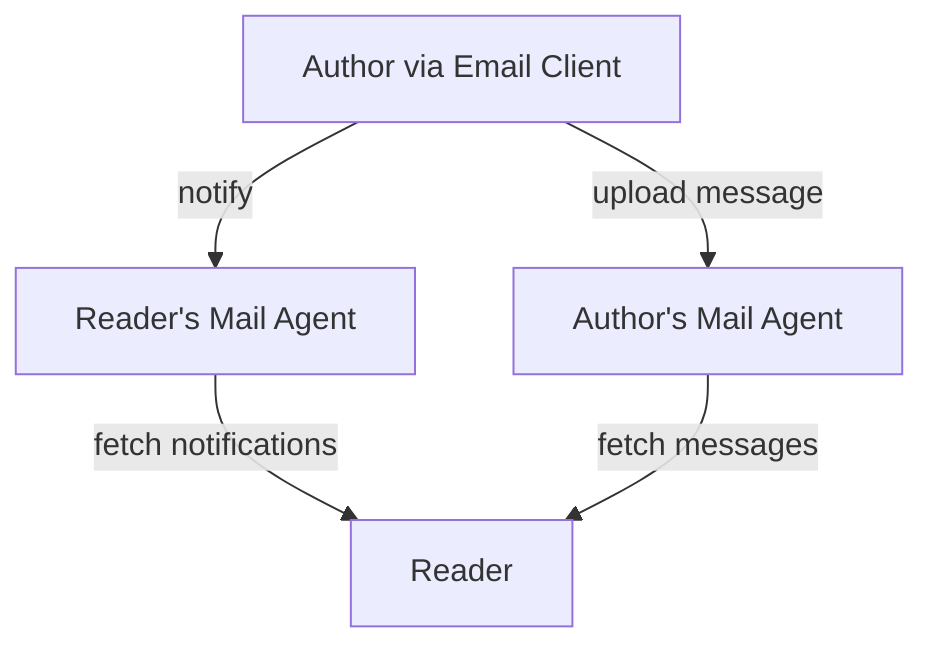
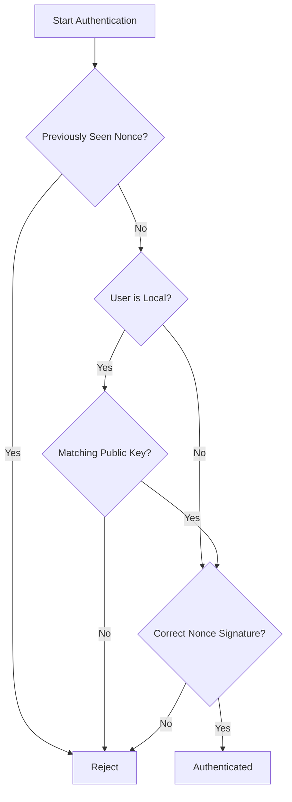

# Mail/HTTPS - The OpenEmail Protocol

[TOC]

# Preface

Legacy email was never intentionally designed; rather, it evolved organically, mimicking physical post-office workflows in a skeuomorphic fashion and inheriting the same underlying paradigms.

It is time to break clean from limitations and vulnerabilities of legacy email, starting from the underlying protocols and assumptions. Here at OpenEmail, we’ve designed a new public, open, decentralized protocol for the privacy and security needs of the modern world.

Named Mail/HTTPS, it is a pull-based message exchange built on top of HTTPS (HTTP over TLS). By thinking of email as sharing protocol rather than a sending one, HTTP emerges as an ideal medium - just as it was originally designed for sharing information online.

With Mail/HTTPS, running systems becomes no more complex than hosting simple websites, making self-hosting again possible. And since it’s both based on a public and open protocol with open source clients and servers, anyone can adopt, develop, and extend it.

It's about time we forget spam, filtering, provider "trust", IP reputations, blacklists, bounces, phishing, spoofing, 10-25MB limits and waiting for messages to "arrive."

Through Mail/HTTPS, OpenEmail brings truly digital native email, defining a new universal public secure channel, for all of us to use.

Having a protocol as an “overlay” on HTTPS tackles the key challenges that plague SMTP-based email - security, authenticity, spam, privacy, size constraints, and message lifecycles.

# Introduction

Mail/HTTPS (Mail over HTTPS - MoH) is a modern, asynchronous, stateless messaging system that leverages existing HTTPS infrastructure to replace traditional, more complex protocols. With its secure yet simple building blocks, Mail/HTTPS drives radical change in messaging, authentication, and open social networking, while simultaneously reducing reliance on centralized third-party entities.

Mail/HTTPS goes beyond just preventing spam and ensuring end-to-end privacy. It simplifies operations and lowers infrastructure overhead. From our experience running large-scale legacy email services, Mail/HTTPS uses up to 80% fewer resources than an equivalent legacy email setup, delivering significant cost savings and drastically reducing environmental impact.

## Complexity

Email, the original killer-app, is a cornerstone of internet communication, yet the traditional push-based SMTP model is increasingly out of step with modern needs. Although many protocol updates (RFCs) have attempted to address issues like spam, phishing, authenticity, reputation and security, these challenges have simply grown in scale alongside email’s overall growth. Yet email use, despite all the negative predictions, just keeps growing.

Progress remains slow because spam filtering conflicts with privacy demands, and spammers rapidly adapt to every new measure. Email hosting is just becoming both more complex and more expensive, without a solution in sight.

At the same time, email remains crucial to our digital world. It underpins account creation, commercial transactions, and serves as a universal online identity. However, modern email infrastructure, largely dominated by three major providers, has grown so complex that control is increasingly becoming centralized. This threatens the open, democratic principles upon which the Internet was built.

## Deliverability

In legacy email context, deliverability is often framed as a top priority - essentially measuring how easily senders can inject emails into our inboxes. Ironically, this contradicts what recipients truly want: by any reasonable standard, we should control what arrives in our inboxes. Yet push-based email grants senders (and their infrastructure) a disproportionate ability to reach us, making filters, blacklists, bounces, and other band-aid solutions a necessity.

It’s time to let go of these obsolete ideas and workarounds.

Mail/HTTPS flips this dynamic entirely. Because it’s pull-based, we, the readers, decide whose messages we retrieve and when. The concept of “deliverability” fades away: the inbox control belongs to us, not to the senders or any middlemen.

## Address Secrecy

In legacy email systems, preserving the secrecy of email addresses is vital, especially for famous individuals, sought-after institutions, and public figures. Exposed email addresses are susceptible to harvesting, spam, phishing, ransomware, and unsolicited messages, leading to significant privacy concerns and potential security risks.

In Mail/HTTPS systems exposing an address does not pose any risks. Unlike in legacy email, knowing the recipient address does not grant access to the inbox. This distinction ensures a higher level of security and privacy for users, allowing them to share their addresses publicly with confidence.

# The New Terminology

Mail/HTTPS is designed to work just like traditional email, so there’s no need to build entirely new email clients or relearn how to communicate. While it maintains familiar functionality, it introduces important changes in terminology for the better, making the email experience more intuitive and user-friendly.

## Authors and Readers

Unlike legacy email, where terms "senders" and "recipients" are commonly used, suggesting a one-way action, Mail/HTTPS employs a passive terminology of "authors" and "readers". In this system, authors compose messages and share them within their own environment with the public or specific readers only. Readers, on the other hand, can retrieve messages from authors, if interested in the author and their messages.

Unlike legacy email, where terms "senders" and "recipients" are commonly used, suggesting a one-way action, Mail/HTTPS employs a passive terminology of "authors" and "readers". In this system, authors compose messages and share them within their own environment with the public or specific readers only. Readers, on the other hand, can retrieve messages from authors, if interested in the author and their messages.

Such shift in terminology emphasizes a more democratic and user-centric approach to email communication, where both sides have full control over their interactions and messages.

## Mail Agents

In Mail/HTTPS, each domain designates one or more always-online mail agents, much like the Mail Exchange (MX) hosts in SMTP. However, unlike MX hosts, these agents do not accept inbound messages from others. Instead, they operate in a store-and-forward fashion, only caching outbound messages for retrieval by the intended readers.

## Email Address

Mail/HTTPS retains the traditional addressing scheme used in SMTP-email systems, with minor normalization based on de-facto accepted addressing scheme. This dual usage allows for the convenience of seamlessly transitioning between legacy and Mail/HTTPS systems without the need for significant changes in the user experience.In Mail/HTTPS, each domain designates one or more always-online mail agents, much like the Mail Exchange (MX) hosts in SMTP. However, unlike MX hosts, these agents do not accept inbound messages from others. Instead, they operate in a store-and-forward fashion, only caching outbound messages for retrieval by the intended readers.

In SMTP-email, addresses are known as “email” addresses because of their specific use for emailing.  Addresses, however, serve a wider purpose beyond mere message transmission. “Email” addresses are today fundamental, easily understood digital identity, functioning as the primary identifier and recovery mechanism throughout the online realm.

In Mail/HTTPS, addresses represent not only users but also their online accounts, profiles, public information, broadcasts, and data. For simplicity, this document refers to what is traditionally called an “email address” simply as an “address.”

## Public Profile

Email originated before the rise of the web and social networking platforms that now dominate our personal and professional interactions. In today’s interconnected world, having insights into someone’s current status, availability, and even location is immensely valuable. This information helps establish effective communication and provides context for interactions. Additionally, certain details extend beyond personal contact lists to be publicly visible, enhancing a person’s online presence.

In the context of email, it’s crucial to understand if we have the right recipients and their availability before sending messages. Without this awareness, we risk setting incorrect expectations and engaging in ineffective communication.

Traditional email systems were not designed to accommodate additional information about email address holders. To address this limitation, various initiatives introduced proprietary add-ons and standards like Web Finger and BIMI. These efforts aimed to provide user information, profile data, or brand images within email communications. However, widespread adoption of these solutions failed to materialize. Consequently, the most common approach to include supplementary information became adding substantial footers to emails or relying on provider-dependent profiles and profile images, lacking standardized enhanced email address information and metadata presentation.

Mail/HTTPS builds on previous efforts to enhance email functionality by introducing user profiles. Each address is linked to a public profile hosted at a standardized URI, which can be directly derived from the email address itself. Profile management is handled by each individual’s mail agents, providing a decentralized yet standardized method for distributing profile information.

Public profiles are not only operationally needed for distributing public cryptographic keys, but they also serve as a trust establishing element in the OpenEmail network.

## Links

Mail/HTTPS restricts messaging to parties that have mutually agreed to engage in a message exchange. Messages are shared only among authorized and consenting users, significantly enhancing privacy and security in the communication process.

To protect users from unauthorized messages and preserve the privacy of correspondents’ identities from third parties such as service or infrastructure providers, Mail/HTTPS creates a unique, mutual connection identifier for each email connection between two parties. This identifier, called a “link,” symbolizes the connection and is derived from the two involved addresses.

Mail/HTTPS links ensure that the identities of correspondents remain confidential and undisclosed to email service providers throughout the duration of the email exchange. At the same time, these links allow service providers to apply allowlisting rules, maintaining security without compromising user privacy.

## Broadcasts

SMTP-based email started as a one-to-one system but was later adapted for multiple recipients without properly addressing secure broadcasting.

However, broadcasting is crucial for both businesses and individuals looking to reach larger audiences - when those recipients agree to receive messages. Because SMTP has no built-in solution for mass messaging, users depend on external “mail blasting” services, which only add to the abuse, complexity, and inefficiency.

Mail/HTTPS bridges this gap with a pull-based system, much like RSS. Instead of pushing messages, authors simply post content, and readers subscribe or unsubscribe at will—using just the author’s address. This approach eliminates the need for broadcasters to manage subscriber lists and ensures that only consenting readers receive messages.

## Encryption

In Mail/HTTPS, private messages are protected by public-key cryptography. Each user’s public encryption key is published in their profile, allowing authors to securely encrypt messages so only the intended readers - who hold matching private keys - can decrypt them.

For messages with multiple readers, Mail/HTTPS uses hybrid encryption:

- A random key is generated to symmetrically encrypt the message content.

- The random key is then encrypted separately with each reader’s public key.

Because the same random key also encrypts metadata, every part of a private message remains fully confidential, preventing unauthorized access or data leaks.

Only private messages in Mail/HTTPS are encrypted, ensuring that sensitive communications remain confidential and readable only by the intended readers. Broadcasts, on the other hand, are intended for public or semi-public sharing and therefore remain unencrypted, allowing anyone to access or follow them.

## Signing

Encryption alone ensures that only the intended readers can decrypt a message, but it does not guarantee that the message truly comes from the claimed author. To address this, every Mail/HTTPS message - private or broadcast - must include a signature generated by the author’s private signing key. Readers validate this signature using the corresponding public signing key found in the author’s profile.

Valid signature confirms that the message genuinely originates from the stated author and has not been altered in transit.

## Keys Rotation

Encryption and signing key pairs are not meant to be permanent and are periodically rotated (replaced by new pairs). During rotation, the old public signing key remains accessible in the user’s profile alongside the new key, ensuring that any still-pending messages can be properly authenticated. The old encryption key on the other hand does not need to stay public once rotation is complete.

Rotation is initiated by the user’s email clients (with explicit user confirmation) and is automatically synchronized across authenticated devices, maintaining security without disrupting ongoing communications.Valid signature confirms that the message genuinely originates from the stated author and has not been altered in transit.

## Authentication

Legacy email primarily relies on password authentication, and while alternative mechanisms have been proposed, most email clients offer little to no support for them.

Weak or reused passwords lead to frequent account compromises, data leaks, and spam-related abuses. Since email doubles as a universal online identity, a stolen password can jeopardize an entire digital life, not just message content.

Mail/HTTPS eliminates passwords. Instead, it uses the private keys as proof of identity. These keys remain on trusted devices, rarely needing to be typed or transferred, which significantly reduces the attack surface for malicious actors.

## Notifications

In a pull-based system like Mail/HTTPS, readers must periodically check (or “poll”) their contacts’ mail agents for new messages. While this ensures privacy and control, frequent polling can be inefficient and is generally used only on a schedule or on demand.

To enable first contact and optimize the retrieval of new messages, Mail/HTTPS provides a lightweight notification mechanism. When an author’s email client uploads a message to the author’s mail agent, it also sends direct notifications to each intended reader’s mail agent. These notifications alert the reader to new content without revealing any actual message data.

If a reader has never communicated with the author before, the notification is treated as a contact request once the reader’s email client validates it. Only after the reader approves this request can the actual messages be retrieved. Readers can also choose to refuse notifications from unknown addresses by configuring their mail agents accordingly.

## Message Lifetime

In SMTP-based systems, message delivery is typically attempted for up to 72 hours. If delivery fails during that window, the message “bounces” back to the sender. Once delivered, it sits in the recipient’s mailbox indefinitely - yet there’s no direct proof the user actually read it. This gap has led to “hacks” like web-bugs or trackers embedded in HTML messages.

Mail/HTTPS handles message lifetime differently by caching each message for at least 7 days. Readers can retrieve the message multiple times from any device within this period. If they never pick it up, the message simply doesn’t reach them, and the author sees that it went unread, providing a privacy-friendly form of feedback without disclosing any personal information about the reader’s environment or actions.

## Storage Separation

Legacy email was originally built on simple remote file transfers, creating a tight link between message delivery and storage. For SMTP email to function, the provider’s online storage effectively serves as the final destination. This setup applies the same security measures to both transfers and archives, which introduces unnecessary complexity and vulnerabilities.

Mail/HTTPS concerns itself only with transfers of messages, just like HTTP(S) on the web: the delivery destination is each user’s device. Should the user want to sync messages to an online archive, they can do so via their local email client, choosing any compatible service they prefer.

## Multiplicity

In contrast to social media platforms which typically limit users to a single identity, Mail/HTTPS natively allows usage of multiple profiles through multiple addresses.

Each address has its own single distinct profile and separate addresses allow users to create and manage different personas for various contexts. This separation of profiles empowers users to maintain distinct presentations for private, fun, casual, and professional interactions, providing greater control over their online identity and presentation.

Users can adapt their communication style and information sharing based on the specific context, just by using different addresses. This is already the norm today with existing addresses, but without attached profiles, it is assumed one single persona shares the addresses. Mail/HTTPS inverts that relation.

## Flow Overview

Now that the building blocks are defined, we can see how they all fit together. The most basic flow of message passing from the author towards the readers is presented in the chart below.



This workflow ensures user control over incoming messages - readers only receive new content from authors they trust, while authors receive clear feedback when a message is (or is not) picked up.

1. **Author Composes Message**: the author creates a message much like in traditional email using an OpenEmail compatible client.
2. **Add Readers & Verify Profiles**: the author adds intended readers and may check each reader’s profile for accuracy, context and status (e.g., availability).
3. **Upload Message**: sending the message uploads it to the author’s own mail agent.
4. **Send Notifications**: once the upload is successful, the author’s email client notifies each reader’s mail agent that a new message is available.
5. **Accept Notifications**: by default, the reader’s mail agent accepts notifications from unknown links if user settings, defined in the public profile allow. Otherwise, it checks the link against the user’s contacts list stored on the agent. If accepted, the notifications are cached on the mail agent for the maximum allowed message lifetime, which applies also to notifications.
6. **Fetch & Validate Notifications**: readers’ email clients periodically fetch notifications from their mail agents. The validity and authenticity of each notification is checked, discarding failed ones.
7. **Fetch Known Contact Messages**: if the notification comes from a known contact (present in the local address book), the reader’s client requests the new message(s) directly from the author’s mail agent. The fetched messages is validate for authenticity, decrypted and shown in the reader’s inbox.
8. **Handling Unknown Contacts**: notifications from authors not in the address book are displayed as "contact requests,” presenting the author’s address and profile but no actual message content.

Accepting contact requests will add the author's address into local contacts and execute a fetch of any pending messages from the accepted contact.
There is no explicit rejection of contact requests as the mail agents and clients automatically expire them. Mail clients may however implement own flows of silencing the contact requests.

# Email Address

RFC5322 email addresses have a very liberal format due to historical reasons and long-obsolete features. Mail/HTTPS uses a simplified, reduced address format which curbs unnecessary challenges in validating and parsing, and with it minimizes discrepancies between different systems.

This simplified address format below, commonly in use today, stood the test of time and is adopted by Mail/HTTPS. Mail/HTTPS concerns itself only with transfers of messages, just like HTTP(S) on the web: the delivery destination is each user’s device. Should the user want to sync messages to an online archive, they can do so via their local email client, choosing any compatible service they prefer.

```
addr-spec         = local-part "@" hostname
local-part        = (letter | digit) {alphanumeric-char}
alphanumeric-char = letter | digit | "-" | "+" | "." | "_"
letter            = "A" | "B" | ... | "Z" | "a" | "b" | ... | "z"
digit             = "0" | "1" | ... | "9"
```

Some valid examples follow.

```
john.doe@open.email
john+tag@mymail.com
this_is_a_valid_email_address@group.example.com
george-work@who.com
jeff.kloster@bigco.org
```

## Character Set

Just as protocols establish standardized methods for communication, the defined character set for addresses serves as a foundational standard. Building on lessons learned from legacy email systems, _Mail/HTTPS prohibits the use of Unicode characters in addresses_ to enhance both security and communication simplicity.

ASCII is universally supported by keyboards worldwide, ensuring that everyone can easily type the same address. As such Mail/HTTPS addresses exclusively use ASCII character subset.

## Local Part

The local-part of a Mail/HTTPS address, referring to the part before the @ sign, is case-insensitive and must not exceed a maximum length of 256 characters.
Only four special characters are allowed, (dot, dash, plus, underscore), but local part may not start or end with a special character, nor can special characters be consecutive.

## Domain Part

The domain portion of an address functions as an identifier for the internet host from which messages are to be retrieved. It is understood as the explicit DNS label. The domain portion may not be an IP address.

## Display Name

Mail/HTTPS addresses intentionally do not include display names in the addresses as these have been greatly misused in SMTP based email. The display name of an address must be retrieved from its public profile.

# Links

The link is generated by taking two addresses, lowercasing them, ordering them alphabetically, concatenating them, and then applying the bare SHA2 hash function defined in RFC 6234, with its result represented in hex encoding.  

The use of SHA2 hash function ensures that the original addresses are transformed into irreversible, fixed-length hash values, protecting the correspondents' identities from direct exposure to the email service providers.

The resulting hash must be considered case insensitive. The deliberate omission of a hashing salt is intentional as utilizing common connection identifiers between two parties allows for efficient access rights determination and facilitates the discovery of network connections, as further elaborated in this document.

Pseudo-code for generating such links follows.

```
FUNCTION GenerateConnectionIdentifier(address1, address2):
    # Normalize the email addresses
    normalizedAddress1 = ToLowerCase(Trim(address1))
    normalizedAddress2 = ToLowerCase(Trim(address2))

    # Sort the addresses alphabetically
    IF normalizedAddress1 < normalizedAddress2 THEN
        sortedAddress1 = normalizedAddress1
        sortedAddress2 = normalizedAddress2
    ELSE
        sortedAddress1 = normalizedAddress2
        sortedAddress2 = normalizedAddress1
    END IF

    # Concatenate the sorted addresses without separators
    concatenatedString = sortedAddress1 + sortedAddress2

    # Calculate the SHA-256 hash of the concatenated string, returning binary
    hash = SHA256(concatenatedString)

    # Return hexadecimal representation of the SHA256 binary
    hashHex = ConvertToHex(hash)    
    RETURN hashHex
END FUNCTION
```

An example of given data follows, illustrating symmetrical property of such links.

```
GenerateConnectionIdentifier('user2@Domain2.tld', 'USER1@domain1.tld') ==
GenerateConnectionIdentifier('user1@domain1.tld', 'user2@domain2.tld') == 
'c841f291d745ae1d3af3bbd4f86e1c184c6c1e6cdd8ed77a64316e12ed0f6a19'
```

# Mail Agent

The underlying architecture of Mail/HTTPS functions as a store-and-forward system using always online mail agents, similar to the Mail-Exchange (MX) relays of SMTP based email. This approach is vital for supporting asynchronous communication, enabling messages to be authored and read at different intervals.

Unlike SMTP-email systems that rely on Mail Transfer Agents (MTAs) for message relaying, which involve at least one additional message retransmission, Mail/HTTPS agents do not relay messages further. Mail/HTTPS agents receive messages from users (authors) over HTTPS and store them locally until the designated readers retrieve them and before message expiry time.

The HTTP protocol was designed for this exact usage and is conveniently utilized in Mail/HTTPS. Message transmission is achieved through a single HTTP upload and single download per reader, simplifying the process and reducing the risk of message loss or delay. Additionally, messages of any size are instantly available upon upload.

## Discovery

To initiate communication, communicating parties must first discover location of users’ mail agents.

SMTP based email relies heavily on DNS records to discover the email destination of a given domain, through lookup of MX records. In Mail/HTTPS however, the discovery method serves the opposite purpose, to deduct the source location from where to retrieve messages, profile information for a given address, and finally - where to deliver notifications. Reversing the flow aids authenticity validation  by retrieving messages directly from the origin via strict HTTPS. This may be further improved with a DNSSEC deployment for the domain.

Mail/HTTPS intentionally does not use pure DNS based discovery. SMTP email predates the web and is incompatible with its document sharing ideas. To this day, direct interaction with SMTP email services from the web is not possible, which also is fortunate due to its security model.

To support new interactions, Mail/HTTPS is a web-native, and it can fully be integrated into the web and the browser, securely, from discovery up to message retrieval.

To discover responsible mail agents for an address, mail clients check for existence of a file at a well-known URI, deduced from the host part of a given address. Well-known URIs are defined in [RFC8615](https://datatracker.ietf.org/doc/html/rfc8615).

For a given address *LOCAL_PART@HOST_PART*, the Mail/HTTPS well-known file is attempted at the following URIs in fail-over manner:

```
HTTPS GET https://HOST_PART/.well-known/mail.txt
HTTPS GET https://mail.HOST_PART/.well-known/mail.txt
```

The well-known URI is retrieved over strict HTTPS over a trusted connection. Contents served over an insecure connection are ignored.

The configuration file is a simple text file with host-names of delegated mail agents on each line. If the configuration file is present and valid, its content is read to determine possible Mail/HTTPS service delegation.

Multiple mail agent host-names may be listed. If multiple host-names are listed, only the first three valid hosts are considered in the order listed. Invalid host names are ignored.

Each line of the well-known file is trimmed for surrounding white space before being considered. Empty lines and those starting with a hash (#) are ignored as comments and white space.

If no well-known files are available or no valid mail agents are determined a final attempt for mail agent is assumed a host-name *mail.HOST_PART*, a subdomain mail of the *HOST_PART* in the email address.

For a selected host-name *MAIL_AGENT_HOSTNAME* to be considered a valid mail agent for a *HOST_PART*, the host must respond with an HTTP OK status 200 to a domain delegation check.

```
HTTPS HEAD https://MAIL_AGENT_HOSTNAME/mail/HOST_PART
```

All determined valid host-names are assumed to have a copy of all users data (profile, links, etc.).

Upon authoring messages, mail clients respect the mail agent delegation setting and store authored messages on at least one of the listed mail agent hosts, respecting order in upload attempts.

When querying and retrieving messages, all mail agent host-names listed in the well-known file are queried.

An example .well-known delegation file is given below.

```
mail.otherdomain1.tld
otherdomain2.tld
```

In the example above, the Mail/HTTPS service is delegated to hosts *mail.otherdomain1.tld* and *otherdomain2.tld*: 

- authored messages are uploaded to both hosts

- when listing messages, readers query both hosts

- when profile updates, both mail agents are updated too

## Optimal Delegation

Discovery prioritizes well-known file and only falls back to the mail subdomain in case the file is not available. To optimize this discovery, it is optimal to use the service on the mail subdomain and include that host-name in the well-known file. Should the web service serving the well-known file be unavailable, the assumed subdomain would still allow service access.

# Public Profile

The public email profile is a plain text file in which each line contains a field as a key-value pair. The pairs are separated by a single colon character, with the key and its corresponding value. The order of the fields in the profile does not matter and the field keys are case insensitive.

It is recommended that profile total size does not exceed 64KB. If this size limit is exceeded, the clients are permitted to truncate it as needed by dropping fields, but not less than the maximum guaranteed size. The actual maximum size is left to mail clients to determine or configure.

The profile always contains the mandatory, functional fields. If any of the mandatory fields is missing, the profile is considered invalid. Profile usually also contain additional, optional fields.

## Profile Location

The user's profile is served by the user's mail agents. The profile is available over HTTPS for public GET requests requiring no authentication.

For a given address *LOCAL_PART@HOST_PART* and *MAIL_AGENT_HOST*, the profile is expected at the path below.

```
HTTPS GET https://MAIL_AGENT_HOST/mail/HOST_PART/LOCAL_PART/profile
```

## Required Fields

Public email profiles offer more than just convenience. they also play a crucial role in facilitating message encryption and validation through the exposure of public cryptographic keys.

A standard public email profile should include, at a minimum, the following essential field which are never empty.

- **Name**: represents the display name associated with the address. The name helps identify the user or entity behind the address. Unlike in the email addresses, UTF8 is accepted. In legacy email, display name was typically written as part of the address as *"name" \<address\>*. 

- **Signing-Key**: provides information about the user's public signing key, utilized to prove authored message authenticity, as well to authenticate the user. Digital signatures enable readers to validate that a message indeed originated from the claimed sender and has remained unaltered during transmission. The following attributes hold the key data:
  
  - "*id*": key-pair identifier, common for the private and public key, uniquely identifying the key pair
  
  - "*algorithm*": is the signing algorithm for which the key is suitable. By default, Mail/HTTPS uses algorithm which will be assumed if the attribute is not present.
  
  - "*value*": contains the base64 encoded public signing key data.

- **Updated**: is the ISO 8601 UTC formatted timestamp indicating the time of the last profile update. When using multiple agents, the profile timestamp permits to identify failed synchronizations.

An example minimal profile file follows.

```
Name: Curious George 🍌
Signing-Key: algorithm=ed25519; value=AwzDTCM2GQu56oyFrek0XskQ5FbVHYD8TaFGm/w/kqc=
Updated: 2023-10-24T19:04:31Z
```

## Optional Fields

Allowing profile owners to freely choose all attributes would result in unstructured data that would pose challenges for programmatic utilization.  Mail/HTTPS defines a set of optional profile attributes which have defined meaning.

The profile attributes do not repeat unless explicitly stated. If non-repeatable attributes are found more than once, only the first occurrence is considered.

All attributes within the user profiles are expected to be and presented in plaintext format. Clients never interpret fields for formatting and always present the raw field.

Exhaustive list of defined fields follows.

- **About**: provides a brief description or summary of the profile owner's background, interests, or personal statement. It is a free-form field.
- **Address-Expansion**: if the address serves as a grouping of other addresses, or is a pointer for "forwarding" further, this fields holds comma separated destination addresses. If the profile address is meant to receive a copy too, it is expected to be included in the expansion list.
- **Away**: if set, the field indicates that the user may not read messages until the away status is removed. Mail clients warn authors from authoring messages for away readers. Address-Expansion field can be used for indicating delegations.
- **Away-Warning**: if set, along with Away, an attempt to author a message brings up this warning in email clients.
- **Birthday**: indicates the date of birth of the profile owner in [ISO 8601](https://www.iso.org/iso-8601-date-and-time-format.html) format (YYYYMMDD).
- **Books**: lists literary works or genres that the profile owner likes to read. It is a free-form field.
- **Department**: denotes the specific department or division within the organization where the profile owner works. It is a free-form field.
- **Education**: provides information about the educational background of the profile owner, including schools attended and degrees earned. It is a free-form field.
- **Encryption-Key**: This field holds the user's public encryption key, required for decrypting messages addressed to the user. Only intended readers can decrypt and read private messages' contents, providing a high level of confidentiality and data protection. An empty or non-present encryption key field indicates that the profile does not accept incoming messages, a feature typically reserved for "no-reply" addresses. The following attributes hold the key data.
    • "*id*": key-pair identifier, common for the private and public key, uniquely identifying the key pair
    • "*algorithm*": indicating the encryption algorithm for which the key is suitable. By default, Mail/HTTPS uses *curve25519xsalsa20poly1305* algorithm which will be assumed if the attribute is not present.
    • "*value*": contains the base64 encoded public encryption key data.
- **Gender**: represents the gender identity or gender expression of the profile owner. It is a free-form field.
- **Interests**: lists hobbies, activities, or topics of interest that the profile owner has indicated. It is a free-form field.
- **Job-Title**: describes the job title or position held by the profile owner within their organization. It is a free-form field.
- **Languages**: indicates the languages spoken or understood by the profile owner. It is a free-form field.
- **Last-Seen-Public**: a special, configuration field indicating whether the mail agent should track and make public the time of last email action. Possible valid values are "*Yes*" and "*No*". The field assumes value "Yes" if not present or invalid.
- **Last-Signing-Key**: provides user's previous signing key and is present after key rotations. The field serves the purpose of verifying messages that were authored during key rotations, as well verifying the user's own API requests on mail agents that are still awaiting key updates. Unlike the signing key, the last encryption key is published rotations and is not present in the profile. Temporary storage of the last encryption key is responsibility of email clients.
- **Location**: may indicate the geographical location such as address or GPS coordinates of the profile owner. It is a free-form field.
- **Mailing-Address**: represents the physical address or mailing address of the profile owner. Not to be confused with profile's Mail/HTTPS address which is implicit and not required in the profile. It is a free-form field.
- **Movies**: lists films or movie genres that the profile owner enjoys. It is a free-form field.
- **Music**: indicates the profile owner's preferred music genres, artists, or songs. It is a free-form field.
- **Notes**: allows for additional remarks or notes about the profile owner, such as preferences, interests, or specific instructions. It is a free-form field.
- **Organization**: denotes the name of the company, organization, or institution the profile owner is affiliated with. It is a free-form field.
- **Phone**: the telephone contact numbers associated with the profile owner. It is a free-form field.
- **Public-Links**: indicates whether others can publicly query for existence of a link among user's contacts. It serves as a way to discover connections within network.
- **Places-Lived**: information about the profile owner's previous or current places of residence or significant locations in their life. This field is free-form, meaning that there are no specific formatting requirements or constraints imposed. Users have the flexibility to input the relevant location data in a way that best suits their preferences, allowing for a customizable representation of their lived experiences and important geographical information.
- **Public-Access**: indicates whether the profile owner accepts notifications from unknown links as contact requests. Mail agents of the profile owner implement this policy upon notifications requests. Possible values are "*Yes*" and "*No*". The field assume default value "*Yes*" if not present or invalid.
- **Relationship-Status**: a free-form field indicating the current relationship status of the profile owner (e.g., single, *in a relationship*, *married*, *looking*, etc.).
- **Sports**: a free-form field, may lists sports activities or teams that the profile owner follows or participates in.
- **Streams**: a coma separated collection of free-form stream tags that readers can use to filter messages during the message pulling process. These tags allow for flexible categorization and organization of messages and can include various labels such as for example "*~family-photos*", "*~notes*", "*~events*", "*~location*".
- **Status**: provides the current status message or context of the profile owner. It is a free-form field.
- **Website**: lists the website(s) associated with the profile owner, as a free-form field.
- **Work**: provides details about the professional work experience of the profile owner. It is a free-form field.

## Unstructured Fields

Any undefined field present in the user's profile is considered custom profile field. Such custom fields are allowed, taken that the mail clients present them after the reserved fields.

# Public Profile Image

Each address may provide a profile image to be used as a thumbnail as well as profile banner. It serves to clearly identify the user of a given address. It is recommended for all addresses to provide a profile image as it helps build trust.

Just as the profile, the profile image can be served only over HTTPS. Profile images served over insecure connections are ignored.

The profile image format can be one of the following: JPEG, GIF, PNG, or WebP and should not exceed 512KB in size. If this size limit is exceeded or the image is invalid, the profile image can be omitted for a placeholder in the mail client at client's discretion.

The profile image should be square, of equal height and width. The recommended image size is 400x400 pixels. The mail agents do not provide alternative sizes of the profile image. It is the responsibility of mail clients to retrieve, resize and cache the profile images.

## Profile Image Location

The user's profile image is served by the user's mail agents. The profile is available over HTTPS for public GET requests requiring no authentication.
For a given address *LOCAL_PART@HOST_PART* and *MAIL_AGENT_HOST*, the profile is expected at the path below.

```
HTTPS GET https://MAIL_AGENT_HOST/mail/HOST_PART/LOCAL_PART/image
```

## Privacy Concerns

In SMTP-email, images are commonly used within HTML messages as "web-bugs" to track events such as opening, as well reader's final IP address and location. Mail/HTTPS profile images are not tied to any particular message and do not invade privacy of the corresponding parties.

# Encryption & Signing

Mail/HTTPS relies on a hybrid combination of asymmetric and symmetric ciphers. The message content and metadata in private messages is first encrypted using symmetric ciphers, effectively avoiding duplication of data when multiple readers are present. The strong random symmetric cipher key used is then encrypted using asymmetric ciphers using each reader's public encryption key.

Both public (broadcasts) and private messages are signed using asymmetric keys.

To ensure adaptability to future developments and prevent the need for versioning, Mail/HTTPS does not lock itself into specific algorithms. It anticipates that algorithms will advance over time and change will be necessary. What remains consistent is the utilization of a combination of asymmetric and symmetric ciphers.

The headers of Mail/HTTPS messages list which ciphers were used for encrypting and signing payloads.

Minimum required algorithms are *sha256* for checksum, *xchacha20poly1305* for symmetric encryption, *curve25519xsalsa20poly1305* for asymmetric encryption and *ed25519* for signing. All of these algorithms are conveniently available as a part of the popular [LibSodium](https://libsodium.gitbook.io) library.

## Key IDs

Key pairs used for encryption and signing are not meant to be permanent. As described previously, the keys are rotated periodically by email clients.

During such rotations, at least for the maximum message lifetime, two key pairs may be referenced. To distinguish between the two in email clients, key identifiers are introduced. These identifiers are meant to be simple and common, to avoid their usage in determining reader identity. Ideally, they are nothing but simple incremental counters starting from 1.

## Fingerprints

Mail/HTTPS, as we will see later in this document, needs to compare keys. Instead of using the full keys in comparison, only sha256 hashes are compared . We simply call those hashes key fingerprints.

## Anonymous Asymmetric Encryption

Asymmetric encryption is used for encrypting the symmetric encryption key which is previously used for sealing the message payload and headers.

Instead of using author's own private encryption key, we use a newly generated anonymous asymmetric encryption key pair to encrypt the symmetric key. The anonymous public key is embedded in the cipher text. Such anonymization shifts the responsibility for the message to the reader, as solely the reader's private key is able to decrypt the message without the need for author's public key. In addition, it theoretically permits that author and reader use different encryption algorithms, as long as they are both based on asymmetric public key cryptography.

Such encryption using ephemeral keys does not authenticate messages. Authenticity is instead determined through signatures.

Libsodium library implements a ready primitive called *Anonymous Box*, based on *Curve25519*, *XSalsa20* and *Poly1305* for asymmetric key encryption of small data, which Mail/HTTPS conveniently takes as default and minimum asymmetric encryption algorithm.

## Large Message Handling

Mail/HTTPS supports messages of any size. However, very large messages can be challenging to decrypt and store on devices with limited processing power or storage. Although streaming encryption is compatible with Mail/HTTPS, it doesn’t allow parallel decryption for large payloads.

To address this, Mail/HTTPS splits large messages (such as those with big attachments) into chunks of up to 64 MB each, which are encrypted individually. This design accommodates both ends of the hardware spectrum, supporting low-powered devices which can decrypt smaller chunks more comfortably without running out of memory, just as more capable devices which can speed things up by parallelizing both the download and decryption of individual chunks.

## Signing

Mail/HTTPS messages embed author signatures of both headers and payload. The same are computed as cryptographic signatures of binary *sha256* checksum of the given data. Care should be taken not to sign hexadecimal data representation instead of the binary checksum data.

# Message Object

Mail/HTTPS objects are accessible through public URIs (Uniform Resource Identifiers). These URIs provide means for locating and retrieving the Mail/HTTPS objects, ensuring they can be accessed and interacted with by readers.

The transportation of a message object is accomplished within a single HTTPS request. A message object consists of both metadata and payload, allowing for the inclusion of relevant information about the message as well as the actual content being transmitted.

Message objects in Mail/HTTPS can be classified as either private or public. Public message objects are accessible to everyone. They lack specified readers and are signed by the author to ensure authenticity. These messages are akin to broadcasts, openly available to anyone interested in their content.

On the other hand, private message objects are encrypted and can only be accessed by designated readers specified by the author. This encryption ensures the confidentiality and security of the message content, restricting access to authorized readers only.

The metadata of a Mail/HTTPS object is efficiently transferred using HTTP headers, enabling a convenient and streamlined transmission of essential information about the message. While transfer-related metadata is not encrypted, message-specific data, including the author, readers, subject, and other confidential information, may be encrypted to ensure privacy and security during transmission.

## Lifetime

Broadcast messages have the minimum duration of 7 days (168 hours) from the time of the upload. If messages are pinned, they are stored permanently and offered to readers in each list request. The message pinning is achieved via the header Message-Pinned presence in the message envelope. There is no limit on the number of pinned messages.

Private Mail/HTTPS messages of most generic category "personal" have a default duration of 7 days (168 hours) from the time of the upload on the mail agent. Authors and their mail clients can decide the actual duration of messages on mail agents. Mail agents on their own do not enforce messages duration, as the removal of private messages is exclusively reserved for mail clients. Author's mail client can be configured to automatically remove private messages collected by all designated readers.
Unlike broadcast messages, private messages cannot be pinned.

Should the reader be unavailable to retrieve the message during the message lifetime, author's mail client notify author of the lack of retrieval. Author may decide to re-notify the readers and keep the message for a longer period. Alternatively, author may drop the message.

## Access Rights

Encrypted messages are only decryptable by the final readers as the decryption keys are encrypted using reader's public encryption key. As such, even public visibility of the encrypted messages would not leak any information about the readers and the content itself.

Nevertheless, in Mail/HTTPS, only designated readers can list and retrieve messages from author's mail agents through authenticated requests, effectively confirming pickup by the reader irrefutably. This universal identified "delivery" confirmation is crucial in official, on-the-record messaging. Its absence in SMTP-email has led to many privacy invading techniques where delivery is confirmed without the recipient consent. Mail/HTTPS makes the message pickup and delivery confirmation completely in the hands of the reader. Should the reader decide for the pickup to be executed, the delivery is confirmed using cryptography.

Access right evaluation and delivery confirmation is done in full anonymity on the mail agent. This is achieved through anonymized authentication where agent operators have no knowledge of the authenticating reader's identity.

Author's private messages awaiting pickup on mail agents provide in envelope header Message-Access a list of connection identifiers and public key fingerprints of designated readers, along with the message decrypting password encrypted anonymously with the reader's public encryption key.

## Message-Id

SMTP-email provides a considerable degree of flexibility in selecting a Message-Id, often resulting in messages being sent without a Message-Id altogether. In contrast, Mail/HTTPS mandates the use of a Message-Id, as it plays a crucial role in ensuring message retrieval. Unlike SMTP-email, where global uniqueness of Message-Ids is the norm by including the sending domain, Mail/HTTPS requires uniqueness only within the author's mail agent, permitting anonymized identifiers.

Message-Ids in Mail/HTTPS are hexadecimal strings, ranging from 32 to 128 characters in length, containing only numeric digits and characters A to F. Message-Ids are treated as case-insensitive, and are URL-safe within the Mail/HTTPS system.

## Payload

In the Mail/HTTPS system, messages are either a body or a file payload. A message cannot contain both simultaneously.

Private messages undergo a robust encryption process to ensure confidentiality and integrity. The author's mail client encrypts the messages locally using a strong, randomly generated password and a symmetric cipher. For secure sharing with readers, the random password is individually encrypted for each reader. This is achieved by encrypting the password with the reader's public encryption key, obtained from the reader's public profile, and a randomly generated asymmetric key-pair. The private key involved in this encryption is discarded, while the corresponding public key is included alongside the cipher-text of the encrypted message.

The responsibility for message confidentiality is effectively shifted to the intended readers. Only authorized readers possessing the respective private keys can successfully decrypt and access the private message. The message content remains private and secure throughout transmission and storage.

## Encoding

SMTP-email uses MIME for encoding messages and allows use of character sets other than ASCII. It also permits embedding additional content into single messages. This is historical bagage and has made email messages unnecessarily complicated.

HTTP, on which Mail/HTTPS relies, can handle multipart bodies, but this involves complex encoding, decoding, and parsing steps. This complexity is burdensome for both server and client development and is inefficient for large files. Additionally, multipart message segments cannot be sent simultaneously, a strategy that typically speeds up data transfer.

Mail/HTTPS does not encode messages beyond encryption in private context. Body of messages, if present, natively supports Unicode. Embedding of additional content into messages is also not possible. Each message is either a text file body or a binary file, transferred within a single HTTP request. Messages that are related reference a parent message by its Message-Id. Email clients' user interfaces hide this implementation detail and reconstruct the single-message illusion.

## Plaintext

Embedded message content is presented to the reader in its raw, text form, without any parsing or interpretation. If the message content is determined not to be of text content type, it it is interpreted as invalid and unsafe, without any attempts of interpreting it.

Mail/HTTPS forbids HTML and similar markup languages which may load remote content or mask link destinations. Any remote content can be easily linked to or included as attachment instead.

Clients can support a subset of MarkDown, removing support for remote content (images) and links masking. Clients can however support Base64 encoded images within MarkDown bodies. The recommended maximum size of Base64 encoded image source is 256KB, though clients can apply own limits.

## Files (Attachments)

Mail/HTTPS allows including files into messages, commonly considered "attachments". While SMTP-based email embeds such files into single multi-body messages, Mail/HTTPS transfers each file in a single or multiple messages referencing the parent message containing the body. Such "message-group" is expected to be downloaded in its entirety and message reconstructed in the reader's email client. The parent message serves as an anchor ("root") for the rest of the message parts and describes the message structure on author's side.

In a message group, there is only a single parent message which serves as a source of truth on the origin message structure. The content header Parent-Id indicates the message is not to be considered on its own and is a part of a message group. Along the same logic, any message not including a "*Parent-Id*" header is considered a representative message. A message group fragment can be referenced and presented only via the parent message and its "*Files*" header. For the relation to be established, the referencing message' "*Parent-Id*" header must match the parent "*Message-Id*", and both messages must be authored by the same user, at the very same time, using the same keys. Relation between messages in a group cannot be established between messages authored at different times or not part of the original message group.

No single message can contain both embedded content and file contents. Such restriction is practical as the body payload itself is indistinguishable from file payloads in messages. To provide an illusion of presence of both in reader's email client, only the parent message is expected to include a representative body, while the referencing messages provide files' contents.

Parent message cannot be of "*file*" type even if the embedded body is empty. Any reference to a parent of "*file*" type, containing a File header or a non-representative body is ignored. It is recommended for email clients to suggest deletion or manual inspection of such messages to the reader.

When a message is very large, it is split into parts which are transferred as own messages. The latter are re-assembled by readers' clients. Splitting larger files into smaller messages brings benefits of parallel message transfers.

## Size

Mail/HTTPS imposes no message size limitations. Any limitations are outcome of either author's own home agent service provider or reader's mail client. Considering the transient nature of messages on mail agents, the message size limit may be considerably high.

Nevertheless, it is recommended to keep individual messages under 64MB, effectively splitting larger messages into smaller messages. The process of splitting and reassembling is unnoticeable to the end user. With such splitting, both authors and readers benefit from faster transfers due to the parallel transfers possibility.

Unlike in SMTP-email, the size restrictions are not imposed by the remote reader's infrastructure. There is no guess work or trial and error when transferring large messages.

## Headers

Mail/HTTPS uses standard HTTP headers for transmitting message information, separate from the message payload (content).

HTTP headers of the message object play a critical role in providing information about the transfer, payload, and nature of messages within the Mail/HTTPS system. These headers are essential for various purposes, including determining the authenticity of messages, establishing access rights for readers, and understanding the overall nature of the messages being exchanged.

Confidential metadata is encapsulated within an encrypted object present within the headers. The object is encrypted using the same password used for encrypting the message content and is found in the "*Message-Content-Headers*" HTTP header, itself anonymously encrypted using readers public key.

Reusing the same random password for encrypting both the content and metadata ensures consistency and simplifies the encryption process. It avoids the need for separate passwords and allows for efficient decryption of both the message content and metadata using the same shared key.

Headers keys are treated as case insensitive both in envelope and within embedded content headers. The headers' values are treated as case sensitive instead. The order of headers appearance is irrelevant, except for the calculation of envelope checksum, in which case the header values should be summed using the defined order in the attribute order of header "*Message-Checksum*".

HTTP specification does not impose headers size limitations, though many web servers and browsers do. Mail/HTTPS uses own servers and clients which permit at least 512KB of headers both in requests and responses.

## Categorization

The conventional approach to email treats all messages as equal, resulting in overloaded inboxes and the laborious task of sorting through them. Many users end up abandoning the effort and retaining all messages, which not only hinders an optimized user experience but consumes unnecessary storage, contributing to a larger carbon footprint. Consequently, methods such as content detection and AI have been employed, further increasing the processing power.

By pre-categorizing messages by authors, it becomes possible to enhance how mail clients display and handle these messages. Additionally, it enables better decision-making regarding whether or not to save them in archives.

We define standard categories for mail object below.

- "**personal**": messages from private circles, the default type of messages.
  "chat": short messages for a less formal conversation type.

- "**transitory**": TOTP, one time access links etc.

- "**notification**": information of an event occurrence such as system alert, sensor information, security notification, parcel shipping status etc.

- "**transaction**": messages related to a private or commercial transaction, such as order confirmation, receipt, refund etc.

- "**promotion**": messages informing of new offerings, sales events etc.

- "**letter**": official communication from organizations, government as well anything that would have been sent as postal mail. While the term "letter" may evoke the idea of a PDF format, it's important to clarify that in this context, the message type does not specifically refer to PDFs. Instead, it pertains to plain text messages where the content is expected to be in the form of plain text within the message body. It is possible to include a PDF file as an additional message of type "file," which could be associated with the "letter" message.

- "**file**": messages containing a single file of any file type.

- "**informational**": messages that are announcements, commonly broadcast that cannot be classified under any other categories.

- "**pass**": messages containing a pass, such as as airplane tickets, theater tickets, invitations etc. The messages may be referenced by other messages containing pass files such as PDF, PKPASS etc.

- "**funds**": this category serves as a placeholder for future developments and potential inclusion of such digital currency-related messages. It anticipates the possibility of incorporating messages that involve digital currency transactions, loyalty program points, or electronic cash in the future.

- "**encryption-key**": Special messages containing a replacement private encryption key. These messages must be authored by the reader, duly encrypted and signed with current keys, and retrieved only from the user's own email agent. Email clients refuse to retrieve remote messages of other authors of this type.

- "**signing-key**": Special messages containing a replacement private signing key. These messages must be authored by the reader, duly encrypted and signed with current keys, and retrieved only from the user's own email agent. Email clients refuse to retrieve remote messages of other authors of this type.

# Message Envelope

Envelope headers are conveniently provided as HTTP headers during uploads/downloads. In private messages, they do not reveal any information about the payload or the communicating party. Broadcast (public) messages on the other hand do not attempt to hide the content or the meta-data and instead focus on origin authentication.

As specified in [RFC2616](https://datatracker.ietf.org/doc/html/rfc2616), HTTP header keys are case insensitive, which reflects also to Mail/HTTPS.

## Required Headers

The following headers are mandatory in all messages.

- **Content-Length**: standard HTTP header indicating the payload size that follows. Both agents and clients use this header to restrict the stream flow, or refuse the request altogether due to disallowed size. Both clients and agents refuse payloads without or with an invalid Content-Length header.

- **Message-Id**: the unique message identifier.

- **Message-Headers**: base64 encoded data of either encrypted headers in private messages, or of plaintext headers in broadcast messages. Expected attributes:
  
  - "*value*": Base64 encoded headers payload
  
  - "*algorithm*": the encryption algorithm used, defaults to xchacha20poly1305, or value none if the data is not encrypted, only encoded

- **Message-Checksum**: checksum information of the envelope headers. Since the order of headers is not guaranteed, the concatenation order used is recorded in the order attribute. Required attributes follow.
  
  - "*algorithm*": the hashing algorithm used for calculating the checksum, defaulting to sha256
  
  - "*order*": lists the concatenation order of headers before checksum calculation , separated by a colon ":" character
  
  - "*value*": the checksum calculated on concatenated headers values without any separators in the specified order

- **Message-Signature:** the checksum data previously calculated in the value of Message-Checksum header is here signed using author's private signing key. Note the signature is calculated on the binary checksum data, and not on the string hexadecimal value.
  
  - "*id*": key-pair identifier, identifying the key used for signing
  
  - "*algorithm*": indicates signing algorithm used, defaulting to *ed25519*
  
  - "value": the signed checksum as a Base64 encoded value

## Conditional Headers

While the previous headers are mandatory in all messages, the following envelope headers depend on the nature of the message.

- **Message-Access**: this header is present only on private messages and it distinguishes message from broadcasts. It contains a list of attribute groups containing connection identifiers (links), public keys and encrypted passwords for determining access rights. Each group identifies a single reader. As standard HTTP header attributes, they are are separated using a semi-column within the group while groups are coma separated. Each message has at least one access group for the author. Each reader has own access group and each group includes the attributes below.
  
  - "*link*": the mutual connection link for the author and designated reader.
  
  - "*fingerprint*": fingerprint of the binary value of reader's public signing key, being simply the sha256 hash of the public key. 
  
  - "*value*": the encrypted symmetric key, Base64 encoded.

  
  - "id": key-pair identifier, identifying the reader's key used for encryption

- **Message-Encryption**: a future-proofing header holding the encryption information used to encrypt the payload, present only on private messages. Contains a single attribute:
  
  - "*algorithm*": the encryption scheme used, defaults to *xchacha20poly1305*

- **Message-Stream**: the public stream, tag or grouping of the message, a free-form value. May be assigned by the author to the message if the message is to be tied to specific stream. Only a single stream tag is permitted.

- **Message-Pinned**: presence of this header is reserved for broadcast messages and indicates that the message should be kept until unpinned. The header has no meaning in private messages. The only valid value is "*Yes*", otherwise the header is treated as not present. Mail agents can choose to ignore this header.

## Content Headers

Previously described envelope contains base64 encoded and encrypted content headers of private messages or just base64 encoded of broadcasts. In both cases, the content headers are contained in the value of the envelope "*Message-Headers*" header.

The content headers are of the same format as the envelope headers.

### Mandatory Headers

 The following headers are mandatory in all messages.

- **Id**: the message identifier, matches the envelope "*Message-ID*" header unless the message is forwarded.

- **Author**: the address of the message author as a valid Mail/HTTPS address.

- **Date**: the authored-on date in [ISO8601](https://www.iso.org/iso-8601-date-and-time-format.html) UTC format, for example `2023-10-24T19:04:31Z`

- **Size**: the size in bytes of the raw content, whether text body or file.

- **Checksum**: checksum of the raw content, whether text body or file.

- **Subject**: plain text subject line for the message.

- **Subject-Id**: unique subject identifier; equals the message identifier of messages initiating new subjects. It is used by mail clients for grouping messages under the same topic (initial subject).

- **Category**: categorization of the message.

### Conditional Headers

The following content headers depend on the message nature.

- **Readers**: the addresses of the readers, comma separated. Always present in private messages, unless the message is forwarded. Author's address is not present among readers as the reader role is implicit here and explicit in envelope Message-Access header.

- **Files**: a parent message only header listing all attached files. The header gives a hint of how the original message was structured upon authoring as well how the message should be re-assembled upon retrieval. The header value is a list, composed of the following attributes in each item.
  
  - "*name*": case sensitive file name, it does not include special or white-space characters, but the final decision on permitted filenames rests with mail clients which can sanitize and rename file names.
  
  - "*id*": the message-id of the message containing the given part
  
  - "*type*": represents the MIME type of the file.
  
  - "*size*": the file size in bytes. This attribute may be present but it is redundant with the content header Size.
  
  - "*part*": if the payload is a chunk of a larger payload, the segment number and total number of segments are expected, e.g. 2/5.
  
  - "*modified*": the file's last modification date at origin in [ISO8601](https://www.iso.org/iso-8601-date-and-time-format.html) UTC format, for example `2023-10-24T19:04:31Z`. The modification date is used to restore the file modification date upon transfer, whenever possible.

- **File**: if the message payload is a file (attachment) or file chunk, this header is present describing the contained file. The header is never present on parent messages. The same attributes of the items listed in the parent's Files header are permitted, but relevant only to the payload.

- **Parent-Id**: contains the "*Message-Id*" of the parent message if the payload contained should be treated as an "attached" file and part of another message.

# Notifications

When an author creates a message intended for specific readers and uploads it to own home agent, the readers are informed of the new message's presence. This can be accomplished through two methods.

- **Polling**: In this method, users periodically check all their contacts' mail agents to see if there are any updates or new messages waiting for them. They poll at regular intervals, either periodically or on-demand, to stay up-to-date with incoming messages. While not most efficient method, it doesn't rely on the reader's infrastructure. Moreover, it requires polling all contacts which may lead to delays in message delivery if polling intervals are not frequent enough. Email clients do have the freedom to implement their own polling logic according to their preferences however.

- **Author Notifications**: This method involves the author directly notifying the designated readers about the presence of new message. When the author creates a message for specific readers, the author's mail client triggers notifications to inform the readers' mail agents about the message. Using notifications is more efficient and immediate, as readers receive notifications in real-time, reducing the need for constant polling and ensuring timely message discovery. However, ithis flow depends on the availability of the readers' mail agents.

Mail/HTTPS uses a combination of both methods, preferring author notifications while periodically polling the contacts.

## Payload

Notifications are initiated from the Mail/HTTPS client of the author and sent directly to the mail agents of the readers.

Each notification includes the author's address, which is encrypted anonymously using the reader's public encryption key. This encrypted address serves a dual purpose:

- it's used for identifying new contact requests and

- verifying the authenticity of the notification when retrieved by the reader's mail client.

The notification call is publicly authenticated with the remote mail agent, requiring a signed nonce in the HTTP headers. However, this nonce is only used for verifying the signature locally. The mail agent itself is unable to independently confirm the authenticity of notifications because it lacks information about their origin.

If the reader configures their home agent to accept notifications exclusively from their own connection identifiers, the mail agent may decline notification requests, essentially also preventing the acceptance of new contact requests.

## Identifier

Upon accepting a notification, mail agents are expected to assign a unique, local identifier to each new notification. The notification identifier is generated locally after the acceptance of the notification and cannot be part of the incoming notification. Identifiers help mail clients keep state of already seen notifications.

The notification identifier is an alpha-numeric string of no more than 32 characters. The identifier may be a counter or generated random string and is unique locally for each notification of a given link.

## Lifetime

Notifications are kept for at least maximum message lifetime upon being received by mail agents.

Should an author repeat a notification while an existing notification which is not yet seen by the reader exists, the new notification is ignored. There is always at maximum one notification per link at the mail agent.

## Verification

The authenticity of notifications is not verified by mail agents and must be completed by mail clients upon retrieval. Each notification contains:

- unique notification identifier

- author's encrypted address as payload

- author's signing fingerprint used to deliver the notification

The authenticity is verified through the following steps:

- checking fingerprint match with readers' public keys (actual and previous)
- decrypting the notification payload with the reader's private key, resulting into author's address
- ensuring author's address is a valid email address
- ensuring link matches author's and reader (local) address
- retrieving author's profile and comparing signing fingerprint with the one of the actual or last public signing key

Should any step fail, the notification is considered bogus and is ignored. Mail clients can mark and cache bogus notifications locally up to its maximum lifetime to avoid further re-checks of the same.

## Execution

Mail clients act only upon verified notifications. If the connection identifier is an existing contact, mail clients can immediately proceed to retrieving remote messages from the contact's mail agent.

If the connection identifier is not an existing contact, mail clients treat it as a contact request. Mail clients never retrieve messages from non-existing contacts in automatic manner. Peeking into remote messages could be allowed by mail clients at the request of the user.

## Suppression

Mail agents and clients can implement suppression for selected links, refusing or ignoring notifications. Such feature is not part of the Mail/HTTPS protocol because legacy email has thought us deny-listing does not work. 

Suppression of a contact request is best handled in the email client itself, while the mail agent should only protect itself from excessive notifications from unlisted links.

# Special Usecases

## Key Rotations

TODO

## Replies

TODO

## Forwarding

TODO

## Threading

TODO

## Broadcasting

TODO

### Direct Public Access

TODO

### Public Indexing

TODO

### Re-broadcasting messages

TODO

### Public Replies

TODO

## Address Expansions

In SMTP-email, messages are often automatically forwarded to other addresses or sent to virtual alias addresses which then distribute the message to multiple recipients. Such setups hide the final readers from the author, who may have disapproved of the message distribution. Moreover, automatic forwarding breaks email authentication protections and increases likelihood of being rejected or silently dropped as spam.

There are valid cases for aliasing/forwarding however: 

- the user may have changed address, and would like to receive messages on the new address, avoiding to monitor multiple mailboxes.

- while away, messages could be delegated to a responsible substitute, a common case in business. 

- a copy could always be desired to the business or family partner

- an archives provider could receive a copy for keeping remote archives.

- a poor man's mailing list, where the list of members (readers) is always contained in one address.

While SMTP-email forwarding happens on relays, Mail/HTTPS provides for similar result but directly within mail client by reading the address expansions from the address' public profile. This permits end-to-end encryption and full knowledge of the final readers by the author.

### Envelope

Envelope lists all resulting readers after the address expansions. There are no traces in the envelope of any expansion.

### Content Headers

The 'Readers' content header document the address expansion by following the expanded address by a column and semi column separated list of expanded addresses. For example:

```
Readers: reader1@domain1.tld, reader2@domain2.tld, expanded.reader@domain3.tld:reader4@somewhereelse.tld;reader5@somewhereelse2.tld
```

Presence of the original expansion in content headers permits authored replies to re-evaluate the expansion based on actual settings.  Expanded addresses are distinguished in mail clients.

# HTTPS API

Mail/HTTPS relies exclusively on HTTPS. Insecure requests over HTTP are not permitted.

## Authentication

Mail/HTTPS mandates authentication for accessing mail agents, both as an author or a reader.

When authenticating as author, the mail agent permits uploading and controlling messages, retrieving notifications, account as well keys management. When authenticating as reader however, authenticated treader may list and retrieve designated messages, which also confirms pick-up by the reader's identity.

The same authentication method can be conveniently used to both home and remote agents as it bases itself on possession of valid private keys. Mail/HTTPS authentication bases itself on HTTP authentication [RFC7235](https://datatracker.ietf.org/doc/html/rfc7235), with own pending scheme named "**SOTN**", an acronym for **Signed-One-Time-Nonce**.

### SOTN Scheme

The SOTN authenticating scheme expects following values to be transferred in the '**Authorization**' HTTP request header:

- "**host**" for which the nonce is intended. The host being authenticated MUST reject request for hosts not matching own hostname, as well requests repeating nonce values.

- "**value**": a random nonce, generated locally in the mail client. The nonce is a random string of no less than 32 ASCII characters. The nonce may not repeat for at least 24 hours with the same service.

- "**algorithm**": the signing algorithm, consistent with the Mail/HTTPS signing algorithms. 

- "**signature**": signature using user's private signing key of the concatenated values of host and nonce in that order, without any separators. Signature is in *detached* mode. 

- "**key**": the public signing key of the user, needed for verifying the signature. The public key MUST be simple Base64 encoded with padding.

The advantage of the SOTN scheme is in the lack of passwords, and the use of signed nonces over HTTPS which provides robust protection against both man-in-the-middle and replay attacks.

Authentication undertakes the following steps:

1. The service being authenticated checks that the provided nonce hasn't been used previously within the past 24 hours.
2. If the service being authenticated is own mail agent, the public key is compared with the same of the user identified.
3. Finally, the signature of the nonce using the provided public key.



### SOTN Authorization Header Example

```
Authorization: SOTN
  nonce=7ypf/xlj9XXwfDPEoM4URrv/xwf94BcCAzFZH4GiTo0v;
  host=destination.host.tld;
  algorithm=ed25519;
  signature=pWHxd1/jCwkO5Ao5+sc+xDI01DWER2VAYBKCDEK/LgPBBw;
  key=ZjoCijxLNI2ts3NgQKNyxNR3E+gROmyEFsI8YUGJGZs
```

## Public API

In Mail/HTTPS, mail agents serve a public API primarily for agent discovery as well storing of notifications and retrieval of messages. The location (hostname) of the mail agent is determined by the well-known scheme described previously in the mail agent discovery part of this document.

### Discovery

Determining if a mail agent is responsible for a particular domain or address is useful for selecting mail agents as well supporting provisioning new accounts.

#### Domain

To determine existence of a *HOST_PART* of a given address *LOCAL_PART@HOST_PART* on a determined mail agent *MAIL_AGENT_HOSTNAME*, following requests can be made:

```
HTTPS HEAD https://MAIL_AGENT_HOSTNAME/mail/HOST_PART
HTTPS GET  https://MAIL_AGENT_HOSTNAME/mail/HOST_PART
```

An *HTTP 200 OK* status response indicates presence of the address while *HTTP 404 Not Found* status its absence. The returned body content is informational only.

#### Address

To determine existence of a given address *LOCAL_PART@HOST_PART* on a determined mail agent *MAIL_AGENT_HOSTNAME*, following requests can be made:

```
HTTPS HEAD https://MAIL_AGENT_HOSTNAME/mail/HOST_PART/LOCAL_PART
HTTPS GET https://MAIL_AGENT_HOSTNAME/mail/HOST_PART/LOCAL_PART
```

An *HTTP 200 OK* status response indicates presence of the address while *HTTP 404* status its absence. The returned body content is informational only.

### Provisioning

Mail agents can permit registering of new accounts publicly on their domains. If permitted, use of the following simple generic account provisioning API is recommended as it would permit direct, standardized provisioning from mail clients.

Abuse  prevention mechanisms are beyond the scope of this document, but mail 
agents can typically restrict or rate limit provisioning based on IP addresses for example.

#### Create

To provision a new account on a selected mail agent, the mail client generates encryption and signing key pairs locally.

Using the generated keys, the signing key in particular, the mail client posts profile data of the account being provisioned of address *LOCAL_PART@HOST_PART* in a **SOTN** authenticated request.

```
HTTPS POST /account/HOST_PART/LOCAL_PART
```

The *Signing-Key* profile attribute is required and must match the authentication public signing key as a proof of profile and private key ownership. While the *Signing-Key* is the only required profile attribute, mail clients will typically provide with a more complete profile information, including *Name*, *Encryption-Key* etc. 

If an account with existing address exists already on the mail agent, an HTTP error status of *HTTP 409 Conflict* is expected. 

A successful provisioning returns *HTTP 200 OK* status code. The returned body content is informational only. Account must be instantly available after a success response.

#### Delete

Mail agents may permit removal of a given account through a **SOTN** authenticated request.

```
HTTPS DELETE /account/HOST_PART/LOCAL_PART
```

A successful deletion request returns *HTTP 200 OK* or *HTTP 202 Accepted* status codes. The returned body content is informational only.

### Profile

The user's profile is served by the user's mail agents. No authentication is required. For a given address *LOCAL_PART@HOST_PART*, the profile is expected at the path below.

```
HTTPS GET /mail/HOST_PART/LOCAL_PART/profile
```

The plaintext response body is expected only with a *HTTP 200 OK* status. If the user is not known by the mail agent, *HTTP 404 Not Found* status is expected.

### Profile Image

The user's profile is served by the user's mail agents. No authentication is required. For a given address *LOCAL_PART@HOST_PART*, the profile is expected at the path below.

```
HTTPS GET /mail/HOST_PART/LOCAL_PART/image
```

The plaintext response body is expected only with a *HTTP 200 OK* status. If the user is not known by the mail agent, *HTTP 404 Not Found* status is expected.

### Links

Any user may query any *LOCAL_PART@HOST_PART* user's mail agent for 
the existence of connection identifier LINK.

```
HTTPS GET /mail/HOST_PART/LOCAL_PART/link/LINK
```

The contact querying does not require authentication. 

The mail agent responds with either:

- *HTTP 200 OK* status if the link exists

- *HTTP 404 Not Found* status if the link does not exist 

- *HTTP 403 Forbidden* if the mail agent user does not consent to public lookups (*Public-Links* profile field)

### Notifications

Once an author makes a message available to readers by uploading it to own mail agents, the author is expected to notify readers' mail agents of the presence of new messages.

The notifications calls require SOTN authentication. 

The payload contains anonymously, asymmetrically encrypted email address of the notification sender using the reader's public encryption key.

Mail agent of the user being notified does not have enough data to verify the notification request and accepts the request even if unverified taken the SOTN authentication succeeds. The verification of the notification validity always happens locally on mail clients using actual profile data. 

For a given reader's address of *LOCAL_PART@HOST_PART* and connection identifier *LINK* between notifier (author) and reader (notification recipient), the notification request 
is made at path bellow.

```
HTTPS PUT /mail/HOST_PART/LOCAL_PART/link/LINK/notifications
```

Accepted notifications are confirmed with a *HTTP 200 OK* status response by the remote mail agent. Any returned body content is informational only.

If the reader does not accept public contact requests (profile field *Public-Access*) and the connection identifier (link) is not known to the reader, the home agent responds with a *HTTP 403 Forbidden* status. The same response is given for notifications directed to self by the user.

Repeated requests for the same link which exists among the reader's links, should 
extend the lifetime of the initial notification just as if the previous notification did not exist.

Repeated requests for non-existing links (contact requests) should however not extend the lifetime of the initial notification.

All notifications past their lifetime are silently dropped on the mail agent.

#### Abuse Prevention

To prevent flooding of contact requests, mail agents may implement protections such as:

- limiting new contact requests for a period of time, e.g. 5 minutes

- limiting contact requests from a given IP to one

- allow only one contact request per given time period.

### Messages

Mail/HTTPS messages API is stateless. The responsibility of keeping state and not re-downloading already retrieved messages is shifted completely to mail clients.

#### Private Messages

After the reader acts upon the notification, its client is expected to connect to the author's mail agent to list and retrieve private messages. All requests to private messages API must be SOTN authenticated.

##### List

For a given author's address of *LOCAL_PART@HOST_PART*, and connection identifier *LINK* between author and reader, the reader may request a list of available messages at the path below.

```
HTTPS GET /mail/HOST_PART/LOCAL_PART/link/LINK/messages
```

If the reader is observing a particular stream of the author identified by stream name STREAM, the available messages are listed at the path below.

```
HTTPS GET /mail/HOST_PART/LOCAL_PART/link/LINK/streams/STREAM/messages
```

Common HTTP status responses apply. The plaintext response body is expected only with a *HTTP 200 OK* status, as a list of message identifiers, each identifier on its own line.

##### Retrieve

Each message identifier *MESSAGE_ID*, obtained previously through list messages command, can be used for requesting the messages with that identifier.

Once the list of identifiers of private messages from author *LOCAL_PART@HOST_PART* 
available for a specific connection identifier *LINK* is obtained, each of the message identifiers *MESSAGE_ID* can be used for retrieving the relevant message from a path below.

```
HTTPS GET /mail/HOST_PART/LOCAL_PART/link/LINK/messages/MESSAGE_ID
```

Successful *HTTP 200 OK* status response contain reserved Mail/HTTPS headers and the response body contains the message payload.

If the message is unknown, *HTTP 404 Not found* response is returned.

#### Broadcast Messages

Broadcast messages are messages without specific readers. As such they are not encrypted but only signed.

While author could send out notifications to all contacts, broadcast messages are retrieved by readers through periodic polling. 

Unlike private messages, requests for listing and retrieving broadcast messages does not require authentication.

##### List

For a given author's address of *LOCAL_PART@HOST_PART*, the reader may request a list of available broadcast messages at the path below.

```
HTTPS GET /mail/HOST_PART/LOCAL_PART/messages
```

If the reader is observing a particular stream of the author identified by stream name *STREAM*, the available messages are listed at the path below.

```
HTTPS GET /mail/HOST_PART/LOCAL_PART/streams/STREAM/messages
```

The plaintext response body is expected only with a *HTTP 200 OK* status, as a list of message identifiers, each identifier on its own line. 

The mail agents are stateless and do not keep state of messages already 
retrieved. It is important that mail clients preserve state of already retrieved messages so that repeated retrieval of messages of same user does not result in duplicated messages.  

##### Retrieve

For a given author's address of *LOCAL_PART@HOST_PART*, and previously obtained message identifier *MESSAGE_ID*, the reader may retrieve the relevant broadcast messages at the path below.

```
HTTPS GET /mail/HOST_PART/LOCAL_PART/messages/MESSAGE_ID
```

Successful *HTTP 200 OK* status response contain reserved Mail/HTTPS headers and the response body contains the message payload.

If the message is unknown, *HTTP 404 Not found* response is returned.

## Private API

While the public mail agent API defines interoperability between clients and mail agents of contacts, the private API defines a universal mail  clients communication with home mail agents.All private mail API requests are under the path *"/home"* and must be authenticated. In the following examples, it is assumed that the user's address is *LOCAL_PART@HOST_PART*.

### Authenticated Discovery

A common requirement in mail clients is to try authentication without any operations, as means of checking if authentication setup is correct.

```
HTTPS HEAD /home/HOST_PART/LOCAL_PART
```

*HTTP 200 OK* status response represents successful authentication. In case of multiple mail agents are delegated to, at least one must authenticate in order for authentication to be considered successful in mail clients. Failing mail agents should be reported to the user by mail clients.

### Notifications

#### List

The private notifications API lists received third party notifications.

```
HTTPS GET /home/HOST_PART/LOCAL_PART/notifications
```

In the response, each notification is listed on its own line as comma separated values

- unique notification identifier, assigned automatically by the mail agent

- the connection link the notification was received for

- author's public signing key, used for delivering the notification.

- the payload sent by authors, containing encrypted author address

Email clients must:

- Verify retrieved notifications before considering them authentic

- Cache notifications locally to ensure same notifications are not repeatedly acted upon


### Messages

#### List

Unlike the public counterpart, the messages list API call lists own, authored messages, awaiting pickup on the mail agent.

```
HTTPS GET /home/HOST_PART/LOCAL_PART/messages
```

The response is a simple list of message identifiers (*MID*), separated by a new line.

#### Status

Mail agents maintain the delivery status of messages. The list call returns only active messages, while the status call should include both active messages and recent reader pickups.

Mail agents are recommended to retain delivery history for 14 to 30 days. Keeping records beyond this period is unnecessary due to potential key rotations.

```
HTTPS GET /home/HOST_PART/LOCAL_PART/messages/MID
```

The response consists of a list where each entry is on a new line. Each entry contains two values separated by a comma: a link and the timestamp of its first access

#### Upload

Uploading call makes the authored message available to readers.

```
HTTPS POST /home/HOST_PART/LOCAL_PART/messages
```

If the message identifier being uploaded already exists on the mail agent, the call is rejected early with status *HTTP 409 Conflict*. 

Updates to already uploaded messages are not permitted, but messages may be revoked by deleting them using the delete request.

#### Delete

The delete request removes the message with id MID from the mail agent and makes it unavailable from reading by readers, even if they have been previously notified by a notification.

```
HTTPS DELETE /home/HOST_PART/LOCAL_PART/messages/MID
```

Response status *HTTP 200 OK* indicates the message has been permanently removed from the mail agent.


### Profile

User profile is stored and served as a simple textual file on the mail agent. 

Management of profile contents is left entirely to mail clients. The mail agent should however refuse to update a profile with invalid, incomplete or oversized content.

#### Update

```
HTTPS PUT /home/HOST_PART/LOCAL_PART/profile
```

### Profile Image

#### Update

User profile image is stored and served as an image file on the mail agent, without any image conversions. The mail agent should refuse to update a profile image with invalid or oversized content.

```
HTTPS PUT /home/HOST_PART/LOCAL_PART/image
```

#### Delete

The profile image may be removed, in which case a placeholder can be served by email clients directly.

```
HTTPS DELETE /home/HOST_PART/LOCAL_PART/image
```

### Links

Links or connection identifiers are stored on mail agents:

- to synchronize contacts among connecting clients

- to enforce notification restrictions 

- to support contact discovery

#### List

The list call retrieves all user's connection identifiers, which implies all user contacts.

```
HTTPS GET /home/HOST_PART/LOCAL_PART/links
```

The response consists of a list where each entry is on a new line. Each entry contains two values separated by a comma: a link and the encrypted email address of the  contact.

#### Store

The store call saves the connection identifier link (*LINK*) on the mail agent of the authenticating user. The request body contains encrypted email address of the respective link contact.

The assumed encryption method is anonymous asymmetric encryption. However, users can configure a different method in their email clients, provided that all of their clients use the same encryption scheme.

```
HTTPS PUT /home/HOST_PART/LOCAL_PART/links/LINK
```

Response status *HTTP 200 OK* indicates the link was successfully stored on the mail agent.

#### Delete

The delete call removes the given connection identifier *LINK* of the authenticating user.

```
HTTPS DELETE /home/HOST_PART/LOCAL_PART/links/LINK
```

Response status *HTTP 200 OK* indicates the link has been permanently removed from the mail agent.
